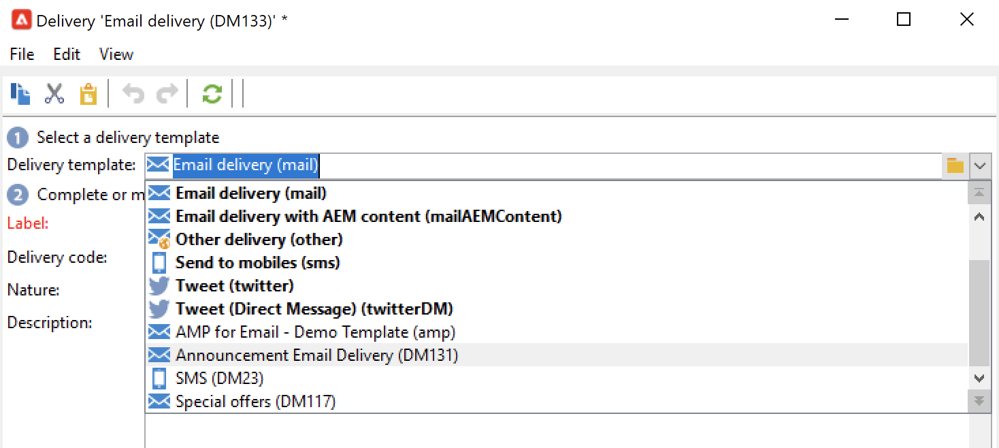

# Creación de su primer envío {#create-a-msg}

En esta página, aprenderá a crear un envío único con un solo paso. Podrá crear otros tipos de envíos para crear sus casos de uso. Obtenga más información sobre los diferentes tipos de envíos y cómo crearlos en [esta página](gs-message.md).

Los pasos clave a la hora de crear un envío con un solo paso son:

1. **Crear un nuevo envío**. [Más información](#create-the-delivery)

1. **Definir el contenido de entrega**. [Más información](#content-of-the-delivery)

1. **Seleccionar la población de público destinatario**. [Más información](#target-population)

A continuación, puede preparar, probar, enviar y supervisar sus mensajes con Adobe Campaign.

>[!NOTE]
>
>Los pasos que se describen a continuación suponen que todos los destinatarios y sus perfiles se almacenan en la base de datos, excepto en el caso de envíos externos. Consulte [Selección de destinatarios externos](#selecting-external-recipients).

## Creación del envío {#create-the-delivery}

Para crear un envío, siga estos pasos:

1. Vaya a la lista de envíos y haga clic en **[!UICONTROL Create]**.
1. Seleccione el canal de envío. Para ello, seleccione la plantilla de envío adecuada en la lista desplegable del campo.

   

   Se proporciona una plantilla integrada para cada canal que tenga instalado: correo electrónico, teléfono, canales de dispositivos móviles (push/SMS), correo directo, X (Twitter), etc. Los canales que se ofrecen en la lista dependen del contrato de licencia.

   Puede crear nuevas plantillas de envío para preconfigurar parámetros específicos que se adapten a sus necesidades.  [Más información](../send/create-templates.md).

1. Introduzca un nombre para el envío en el campo **[!UICONTROL Label]**.

   (opcional) También puede asignar un código de envío al envío. El nombre del envío y su código aparecen en la lista de envíos, pero los destinatarios no pueden verlos.

1. (opcional) Añada una descripción al campo **[!UICONTROL Description]**.
1. (opcional) Seleccione la naturaleza del envío en el campo correspondiente. Esta información resulta útil para el seguimiento de envíos: puede filtrarlos en función de este criterio en la lista de envíos o crear consultas utilizando este criterio de selección.
1. Haga clic en **[!UICONTROL Continue]** para mostrar la ventana de contenido del mensaje.

## Definir el contenido del envío {#content-of-the-delivery}

El contenido de la entrega está listo para configurarse. La definición del contenido de la entrega es específica para cada canal. Para obtener más información, consulte la sección dedicada:

* [Definición del contenido del correo electrónico](../send/email.md)
* [Definición del contenido del SMS](../send/sms/sms-content.md)
* [Definición del contenido de correo postal](../send/direct-mail.md)
* [Definición del contenido de la notificación push](../send/push.md)

## Definición del público destinatario {#target-population}

Para cada envío, se pueden definir varios tipos de públicos destinatarios:

* **Público principal**: perfiles que reciben mensajes. [Más información](#select-the-main-target)
* **Público destinatario de prueba**: perfiles que reciben mensajes de prueba. Una prueba es un mensaje específico que permite probar un mensaje antes de enviarlo al público destinatario principal. [Más información](#select-the-proof-target)

Además, en el contexto de una campaña de marketing, puede añadir lo siguiente:

* **Direcciones semilla**: destinatarios que están fuera del objetivo del envío, pero que reciben el envío. [Más información](../audiences/test-profiles.md)
* **Grupos de control**: la población que no recibe el envío, se usa para rastrear el comportamiento y el impacto de la campaña. [Más información](../../automation/campaigns/marketing-campaign-target.md#add-a-control-group).

### Selección de los principales destinatarios de la entrega {#select-the-main-target}

En la mayoría de los casos, el público destinatario principal se extrae de la base de datos de Adobe Campaign (modo predeterminado). No obstante, los destinatarios también se pueden almacenar en un [archivo externo](#selecting-external-recipients). 

Para seleccionar los destinatarios de un envío, siga los siguientes pasos:

1. En el editor de envíos, seleccione **[!UICONTROL To]**.
1. Si los destinatarios están almacenados en la base de datos, seleccione la primera opción.

   {zoomable="yes"}

1. Seleccione la [asignación de público destinatario](../audiences/target-mappings.md) en la lista desplegable **[!UICONTROL Target mapping]**.
1. Haga clic en el botón **[!UICONTROL Add]** para definir los filtros de restricción.

   {width="60%" align="left" zoomable="yes"}

   Seleccione un tipo de filtro y haga clic en **[!UICONTROL Next]** para definir las condiciones. Puede mostrar los destinatarios filtrados en la pestaña **[!UICONTROL Preview]**. En función del tipo de público destinatario, el botón **[!UICONTROL Refine target]** le permite combinar varios criterios de segmentación.

   Están disponibles los siguientes modos de aprobación:

   * **[!UICONTROL Filtering conditions]**: utilice esta opción para definir una consulta y mostrar el resultado. Aprenda a diseñar una consulta en [esta sección](../../automation/workflow/query.md).
   * **[!UICONTROL A list of recipients]**: utilice esta opción para seleccionar una lista de perfiles. Más información sobre listas en [esta sección](../audiences/create-audiences.md).
   * **[!UICONTROL A recipient]**: utilice esta opción para seleccionar un perfil específico en la base de datos.
   * **[!UICONTROL Recipients included in a folder]**: utilice esta opción para seleccionar todos los perfiles contenidos en una carpeta específica.
   * **[!UICONTROL Recipients of a delivery]**: utilice esta opción para generar el objetivo a partir de los destinatarios de un envío. A continuación, se debe seleccionar el envío en la lista:

     

   * **[!UICONTROL Delivery recipients belonging to a folder]**: utilice esta opción para generar el objetivo a partir de los envíos de destinatarios incluidos en una carpeta específica.

     

     Se puede filtrar el comportamiento de los destinatarios seleccionando una de las opciones de la lista desplegable:

     

     >[!NOTE]
     >
     >La opción **[!UICONTROL Include sub-folders]** también permite dirigir los envíos contenidos en carpetas ubicadas en la estructura del árbol debajo del nodo seleccionado.

   * **[!UICONTROL Subscribers of an information service]**: esta opción permite seleccionar un boletín informativo al que se deben suscribir los destinatarios para ser objetivos del envío que se está creando.

     

   * **[!UICONTROL User filters]**: esta opción le permite acceder a los filtros preconfigurados para utilizarlos como criterios de filtrado para los perfiles de la base de datos. Los filtros preconfigurados se muestran en [esta sección](../audiences/create-filters.md#default-filters).
   * La opción **[!UICONTROL Exclude recipients from this segment]** le permite dirigirse a los destinatarios que no cumplen con los criterios de objetivo definidos. Para utilizar esta opción, seleccione el cuadro apropiado y, a continuación, aplique los objetivos, según lo definido anteriormente, para excluir los perfiles resultantes.

1. Introduzca un nombre para estos objetivos en el campo **[!UICONTROL Label]**. De forma predeterminada, la etiqueta es la etiqueta del primer criterio de segmentación. Al combinar criterios de filtrado, se recomienda utilizar un nombre explícito.
1. Haga clic en **[!UICONTROL Finish]** para validar las opciones de segmentación.

   Los criterios de objetivo definidos se resumen en la sección central de la pestaña de configuración del objetivo principal. Haga clic en un criterio para ver su contenido (configuración y previsualización). Para eliminar un criterio, haga clic en la cruz situada después de su etiqueta.

   

### Selección de destinatarios externos {#selecting-external-recipients}

Puede enviar mensajes a los perfiles que no se hayan guardado en la base de datos, sino, en un archivo externo. Por ejemplo, para enviar un envío a los destinatarios importados desde un archivo de texto, siga estos pasos:

1. Haga clic en el vínculo **[!UICONTROL To]** para seleccionar los destinatarios de la entrega.
1. Seleccione la opción **[!UICONTROL Defined in an external file]**.
1. Seleccione el archivo que contiene los destinatarios.
1. Al importar los destinatarios, haga clic en enlace **[!UICONTROL File format definition...]** para seleccionar y configurar el archivo externo.

   Para obtener más información sobre la importación de los datos, consulte la [documentación de la versión 7 de Campaign Classic](https://experienceleague.adobe.com/es/docs/campaign-classic/using/getting-started/importing-and-exporting-data/generic-imports-exports/executing-import-jobs#step-2---source-file-selection){target="_blank"}.

1. Haga clic en **[!UICONTROL Finish]** y configure el envío como entrega estándar.

>[!CAUTION]
>
>Al definir el contenido del mensaje para el envío por correo electrónico, no incluya el vínculo a la página espejo; no se puede generar en este modo de envío.

### Configuración de la exclusión {#define-exclusion-settings}

Al definir el [público de un envío](#target-population), se usa la pestaña **[!UICONTROL Exclusions]** para limitar el número de mensajes. Se recomiendan los parámetros predeterminados, pero los ajustes se pueden adaptar según sus necesidades. Sin embargo, estas opciones solo debe modificarlas un usuario experto para evitar errores y un uso incorrecto.

>[!CAUTION]
>
>Como usuario experto, en casos de uso específicos, puede cambiar esta configuración, pero Adobe recomienda mantener la configuración predeterminada.

Puede elegir excluir las direcciones que han alcanzado un determinado número de errores consecutivos o cuya clasificación de calidad está por debajo del umbral especificado en esta ventana. También puede elegir si desea o no autorizar direcciones no clasificadas para las que no se ha devuelto ningún dato.

Para modificar la configuración predeterminada, haga clic en el vínculo **[!UICONTROL Edit...]**.

+++ Consulte las opciones disponibles

* **[!UICONTROL Exclude duplicate addresses during delivery]**: esta opción está activa de forma predeterminada y elimina las direcciones de correo electrónico duplicadas durante el envío. La estrategia aplicada puede variar según la forma en que se utilice Adobe Campaign y el tipo de datos de la base de datos. El valor predeterminado de la opción se puede configurar para cada plantilla de envío.
* **[!UICONTROL Exclude recipients who no longer want to be contacted]**, es decir, destinatarios cuyas direcciones de correo electrónico estén en una lista de bloqueados (“exclusión”). Esta opción debe permanecer seleccionada para respetar la ética profesional del marketing electrónico.
* **[!UICONTROL Exclude quarantined recipients]**: esta opción permite excluir del público destinatario cualquier perfil cuya dirección esté en cuarentena. Se recomienda mantener seleccionada esta opción. Obtenga más información sobre los conectores disponibles en [esta sección](../send/quarantines.md).
* **[!UICONTROL Limit delivery]** a un número determinado de mensajes. Esta opción permite introducir el número máximo de mensajes a enviar. Si el público destinatario supera el número de mensajes indicados, se le aplica una selección aleatoria. Para enviar todos los mensajes, mantenga este valor en “0”.
* **[!UICONTROL Keep duplicate records (same identifier)]**: esta opción permite autorizar varios envíos a destinatarios que cumplan varios criterios de segmentación.
+++

### Selección de los destinatarios de los mensajes de prueba {#select-the-proof-target}

En el caso de los envíos por correo electrónico, puede enviar pruebas para validar el contenido del mensaje. El envío de pruebas le permite comprobar el vínculo de no participación, la página espejo y cualquier otro vínculo, validar el mensaje, comprobar que se muestran las imágenes, detectar posibles errores, etc. También es posible que desee comprobar el diseño y el procesamiento en distintos dispositivos.

Una prueba es un mensaje específico que le permite probar un mensaje antes de enviarlo al público principal. Los destinatarios de la prueba se encargan de aprobar el mensaje: procesamiento, contenido, valores de ajuste de personalización, configuración.

Para obtener más información sobre los destinatarios de la prueba y el envío, consulte [esta sección](../send/preview-and-proof.md#send-proofs).

#### Tutorial en vídeo {#seeds-and-proofs-video}

En este vídeo aprenderá a añadir semillas y pruebas a un correo electrónico existente y a enviarlo.

>[!VIDEO](https://video.tv.adobe.com/v/333404?quality=12)

Hay disponibles más vídeos de procedimientos para Campaign Classic [aquí](https://experienceleague.adobe.com/docs/campaign-classic-learn/tutorials/overview.html?lang=es).

## Preparación y validación del envío {#validate-the-delivery}

Cuando se ha creado y configurado una entrega, se debe validar antes de enviarlo al objetivo principal.

Para ello:

1. **Analice la entrega**: este paso permite preparar los mensajes que se van a enviar. [Más información](../send/delivery-analysis.md).

1. **Envío de pruebas**: este paso permite controlar el contenido, las direcciones URL, la personalización, etc. [Más información](../send/preview-and-proof.md).

>[!IMPORTANT]
>
>Los dos pasos anteriores **deben** ejecutarse después de cada modificación del contenido del mensaje.

## Configuración y envío de la entrega {#configuring-and-sending-the-delivery}

Acceda a los parámetros de envío para configurar más ajustes y definir cómo enviar los mensajes. Puede definir la prioridad de envío, configurar las olas de envío, configurar los reintentos y probar el envío. Una vez realizada la configuración, puede confirmar el envío. Los mensajes se envían inmediatamente o en función de la programación de los envíos.

Obtenga información sobre cómo configurar los valores de envío en [esta página](../send/configure-and-send.md).
