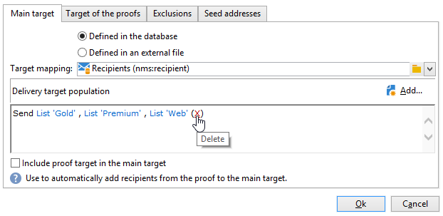

# Creación de la primera entrega {#create-a-msg}

En esta página, aprenderá a crear una entrega única con una sola toma. Puede crear otros tipos de envíos para abordar los casos de uso. Obtenga más información acerca de los diferentes tipos de envíos y cómo crearlos en [esta página](gs-message.md).

Los pasos clave al crear una entrega de una sola toma son:

1. **Crear un nuevo envío**. [Más información](#create-the-delivery)

1. **Definir el contenido de entrega**. [Más información](#content-of-the-delivery)

1. **Seleccione la población objetivo**. [Más información](#target-population)

A continuación, puede preparar, probar, enviar y supervisar sus mensajes con Adobe Campaign.

>[!NOTE]
>
>Los pasos descritos en esta sección suponen que todos los destinatarios objetivo y sus perfiles se almacenan en la base de datos, excepto en el caso de envíos externos. Consulte [Selección de destinatarios externos](#selecting-external-recipients).

## Creación de la entrega {#create-the-delivery}

Para crear una entrega, siga estos pasos:

1. Vaya a la lista de envíos y haga clic en **[!UICONTROL Create]**.
1. Seleccione el canal de entrega. Para ello, elija la plantilla de envío adecuada en la lista desplegable.

   

   Se proporciona una plantilla integrada para cada canal instalado: correo electrónico, teléfono, canales móviles (push/SMS), correo directo, X (Twitter), etc. Los canales disponibles en la lista dependen del acuerdo de licencia.

   Puede crear nuevas plantillas de envío para preconfigurar parámetros específicos que se adapten a sus necesidades.  [Más información](../send/create-templates.md).

1. Introduzca un nombre para la entrega en el campo **[!UICONTROL Label]**.

   (opcional) También se puede asignar un código de envío a la entrega. El nombre de la entrega y su código son visibles en la lista de envíos, pero no están expuestos a los destinatarios.

1. (opcional) Agregue una descripción en el campo **[!UICONTROL Description]**.
1. (opcional) Seleccione la naturaleza de la entrega en el campo correspondiente. Esta información resulta útil para el seguimiento de envíos: puede filtrarlos en función de este criterio en la lista de envíos o crear consultas utilizando este criterio de selección.
1. Haga clic en **[!UICONTROL Continue]** para mostrar la ventana de contenido del mensaje.

## Definición del contenido de envío {#content-of-the-delivery}

El contenido de la entrega está listo para configurarse. La definición del contenido de la entrega es específica para cada canal. Para obtener más información, consulte la sección dedicada:

* [Definición del contenido del correo electrónico](../send/email.md)
* [Definición del contenido del SMS](../send/sms/sms-content.md)
* [Definición del contenido de correo postal](../send/direct-mail.md)
* [Definición del contenido de las notificaciones push](../send/push.md)

## Definición de la audiencia objetivo {#target-population}

Para cada envío, se pueden definir varios tipos de audiencias de destino:

* **Audiencia principal**: perfiles que reciben mensajes. [Más información](#select-the-main-target)
* **Destino de prueba**: perfiles que reciben mensajes de prueba. Una prueba es un mensaje específico que permite probar un mensaje antes de enviarlo al destino principal. [Más información](#select-the-proof-target)

Además, en el contexto de una campaña de marketing, puede agregar lo siguiente:

* **Direcciones semilla**: destinatarios que están fuera del objetivo de la entrega, pero que reciben la entrega. [Más información](../audiences/test-profiles.md)
* **Grupos de control**: población que no recibe el envío, se usa para rastrear el comportamiento y el impacto de la campaña. [Más información](../../automation/campaigns/marketing-campaign-target.md#add-a-control-group).

### Selección de los principales destinatarios de la entrega {#select-the-main-target}

En la mayoría de los casos, el objetivo principal se extrae de la base de datos de Adobe Campaign (modo predeterminado). Sin embargo, los destinatarios también se pueden almacenar en un [archivo externo](#selecting-external-recipients).

Para seleccionar los destinatarios de un envío, siga los siguientes pasos:

1. En el editor de envíos, seleccione **[!UICONTROL To]**.
1. Si los destinatarios están almacenados en la base de datos, seleccione la primera opción.

   {zoomable="yes"}

1. Seleccione la [asignación de destino](../audiences/target-mappings.md) en la lista desplegable **[!UICONTROL Target mapping]**.
1. Haga clic en el botón **[!UICONTROL Add]** para definir los filtros de restricción.

   {width="60%" align="left" zoomable="yes"}

   Seleccione un tipo de filtro y haga clic en **[!UICONTROL Next]** para definir las condiciones. Puede mostrar los destinatarios filtrados desde la ficha **[!UICONTROL Preview]**. Según el tipo de destino, el botón **[!UICONTROL Refine target]** le permite combinar varios criterios de destino.

   Están disponibles los siguientes tipos de público objetivo:

   * **[!UICONTROL Filtering conditions]**: utilice esta opción para definir una consulta y mostrar el resultado. Aprenda a diseñar una consulta en [esta sección](../../automation/workflow/query.md).
   * **[!UICONTROL A list of recipients]**: utilice esta opción para segmentar una lista de perfiles. Obtenga más información sobre las listas en [esta sección](../audiences/create-audiences.md).
   * **[!UICONTROL A recipient]**: utilice esta opción para seleccionar un perfil específico en la base de datos.
   * **[!UICONTROL Recipients included in a folder]**: utilice esta opción para segmentar todos los perfiles contenidos en una carpeta específica.
   * **[!UICONTROL Recipients of a delivery]**: utilice esta opción para generar el objetivo a partir de los destinatarios de una entrega. A continuación, se debe seleccionar la entrega en la lista:

     

   * **[!UICONTROL Delivery recipients belonging to a folder]**: utilice esta opción para generar el objetivo a partir de los envíos de destinatarios incluidos en una carpeta específica.

     

     Se puede filtrar el comportamiento de los destinatarios seleccionando una de las opciones de la lista desplegable:

     

     >[!NOTE]
     >
     >La opción **[!UICONTROL Include sub-folders]** también permite dirigir los envíos contenidos en carpetas ubicadas en la estructura del árbol debajo del nodo seleccionado.

   * **[!UICONTROL Subscribers of an information service]**: esta opción permite seleccionar un boletín informativo al que se deben suscribir los destinatarios para ser objetivos de la entrega que se está creando.

     

   * **[!UICONTROL User filters]**: esta opción le permite acceder a los filtros preconfigurados para utilizarlos como criterios de filtrado para los perfiles de la base de datos. Los filtros preconfigurados se muestran en [esta sección](../audiences/create-filters.md#default-filters).
   * La opción **[!UICONTROL Exclude recipients from this segment]** le permite dirigirse a los destinatarios que no cumplan con los criterios de destino definidos. Para utilizar esta opción, seleccione el cuadro apropiado y, a continuación, aplique los objetivos, según lo definido anteriormente, para excluir los perfiles resultantes.

1. Introduzca un nombre para estos objetivos en el campo **[!UICONTROL Label]**. De forma predeterminada, la etiqueta es la etiqueta del primer criterio de objetivo. Al combinar criterios de filtrado, se recomienda utilizar un nombre explícito.
1. Haga clic en **[!UICONTROL Finish]** para validar las opciones de segmentación.

   Los criterios de objetivo definidos se resumen en la sección central de la pestaña de configuración del objetivo principal. Haga clic en un criterio para ver su contenido (configuración y previsualización). Para eliminar un criterio, haga clic en la cruz situada después de su etiqueta.

   

### Selección de destinatarios externos {#selecting-external-recipients}

Puede enviar mensajes a perfiles que no estén almacenados en la base de datos, sino en un archivo externo. Por ejemplo, para enviar una entrega a los destinatarios importados desde un archivo de texto, siga estos pasos:

1. Haga clic en el vínculo **[!UICONTROL To]** para seleccionar los destinatarios de la entrega.
1. Seleccione la opción **[!UICONTROL Defined in an external file]**.
1. Seleccione el archivo que contiene los destinatarios.
1. Al importar los destinatarios, haga clic en enlace **[!UICONTROL File format definition...]** para seleccionar y configurar el archivo externo.

   Para obtener más información sobre la importación de datos, consulte [Documentación de Campaign Classic v7](https://experienceleague.adobe.com/en/docs/campaign-classic/using/getting-started/importing-and-exporting-data/generic-imports-exports/executing-import-jobs#step-2---source-file-selection){target="_blank"}.

1. Haga clic en **[!UICONTROL Finish]** y configure la entrega como entrega estándar.

>[!CAUTION]
>
>Al definir el contenido del mensaje para la entrega por correo electrónico a destinatarios externos, no incluya el vínculo a la página espejo: no se puede generar en este modo de entrega.

### Configuración de exclusión {#define-exclusion-settings}

Al definir la [audiencia de una entrega](#target-population), se usa la pestaña **[!UICONTROL Exclusions]** para limitar el número de mensajes. Se recomiendan los parámetros predeterminados, pero los ajustes se pueden adaptar según sus necesidades. Sin embargo, estas opciones solo debe modificarlas un usuario experto para evitar errores y un uso incorrecto.

>[!CAUTION]
>
>Como usuario experto, en casos de uso específicos, puede cambiar esta configuración, pero Adobe recomienda mantener la configuración predeterminada.

Puede excluir las direcciones que han alcanzado un determinado número de errores consecutivos o cuya clasificación de calidad está por debajo del umbral especificado en esta ventana. También puede elegir si desea o no autorizar direcciones no clasificadas para las que no se ha devuelto ningún dato.

Para modificar la configuración predeterminada, haga clic en el vínculo **[!UICONTROL Edit...]**.

+++ Ver las opciones disponibles

* **[!UICONTROL Exclude duplicate addresses during delivery]**: esta opción está activa de forma predeterminada y elimina las direcciones de correo electrónico duplicadas durante la entrega. La estrategia aplicada puede variar según la forma en que se utilice Adobe Campaign y el tipo de datos de la base de datos. El valor de la opción se puede configurar para cada plantilla de envío.
* **[!UICONTROL Exclude recipients who no longer want to be contacted]**, es decir, destinatarios cuyas direcciones de correo electrónico estén en una lista de bloqueados (&quot;exclusión&quot;). Esta opción debe permanecer seleccionada para respetar la ética profesional de marketing electrónico.
* **[!UICONTROL Exclude quarantined recipients]**: esta opción permite excluir del destino cualquier perfil con una dirección en cuarentena. Se recomienda mantener seleccionada esta opción. Obtenga más información acerca de la administración de cuarentena en [esta sección](../send/quarantines.md).
* **[!UICONTROL Limit delivery]** a un número determinado de mensajes. Esta opción permite introducir el número máximo de mensajes a enviar. Si la audiencia de destino supera el número de mensajes indicados, se le aplica una selección aleatoria. Para enviar todos los mensajes, mantenga este valor en &quot;0&quot;.
* **[!UICONTROL Keep duplicate records (same identifier)]**: esta opción permite enviar varios envíos a destinatarios que cumplan varios criterios de objetivo.
+++

### Selección de los destinatarios de los mensajes de prueba {#select-the-proof-target}

En el caso de las entregas de correo electrónico, puede enviar pruebas para validar el contenido del mensaje. El envío de pruebas le permite comprobar el vínculo de no participación, la página espejo y cualquier otro vínculo, validar el mensaje, comprobar que se muestran las imágenes, detectar posibles errores, etc. También es posible que desee comprobar el diseño y el procesamiento en distintos dispositivos.

Una prueba es un mensaje específico que le permite probar un mensaje antes de enviarlo a la audiencia principal. Los destinatarios de la prueba se encargan de aprobar el mensaje: procesamiento, contenido, configuración y configuración.

Para obtener más información sobre los destinatarios de prueba y el envío, consulte [esta sección](../send/preview-and-proof.md#send-proofs).

 [Descubra esta funcionalidad en vídeo](#seeds-and-proofs-video)

#### Tutorial en vídeo {#seeds-and-proofs-video}

En este vídeo aprenderá a añadir semillas y pruebas a un correo electrónico existente y a enviarlo.

>[!VIDEO](https://video.tv.adobe.com/v/333404?quality=12)

Hay disponibles más vídeos de procedimientos para Campaign Classic [aquí](https://experienceleague.adobe.com/docs/campaign-classic-learn/tutorials/overview.html?lang=es).

## Preparación y validación de la entrega {#validate-the-delivery}

Cuando se ha creado y configurado una entrega, se debe validar antes de enviarlo al objetivo principal.

Para ello:

1. **Analice la entrega**: este paso permite preparar los mensajes que se van a enviar. [Más información](../send/delivery-analysis.md).

1. **Envío de pruebas**: este paso permite controlar el contenido, las direcciones URL, la personalización, etc. [Más información](../send/preview-and-proof.md).

>[!IMPORTANT]
>
>Los dos pasos anteriores DEBEN ejecutarse después de cada modificación del contenido del mensaje.

## Configuración y envío de la entrega {#configuring-and-sending-the-delivery}

Acceda a los parámetros de envío para configurar más ajustes y definir cómo enviar los mensajes. Puede definir la prioridad de entrega, configurar las olas de entrega, configurar los reintentos y probar la entrega de entrega. Una vez completada esta configuración, puede confirmar el envío. Los mensajes se envían inmediatamente o en función de la programación de envíos.

Aprenda a configurar las opciones de entrega en [esta página](../send/configure-and-send.md).
