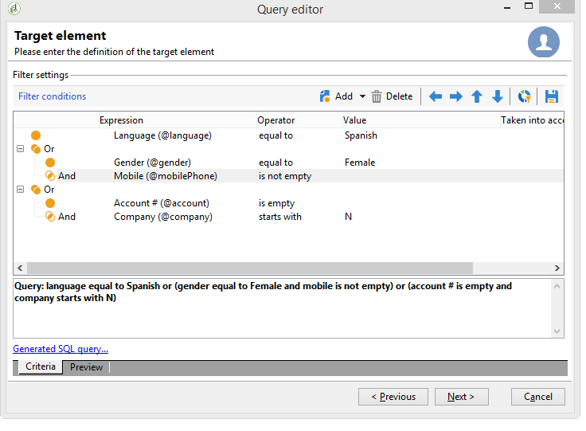

# Definición de condiciones de filtro{#filter-conditions}

Para diseñar la consulta, debe seleccionar las condiciones de filtrado en el editor de consultas. Las funciones disponibles y los casos de uso se detallan en esta página.

## Selección del operador {#choose-operator}

Dentro de las condiciones de filtrado, es necesario vincular dos valores mediante un operador.

A continuación se muestra una lista de los operadores disponibles:

<table> 
 <thead> 
  <tr> 
   <th> Operador  </th> 
   <th> Objetivo  </th> 
   <th> Ejemplo  </th> 
  </tr> 
 </thead> 
 <tbody> 
  <tr> 
   <td> Equal to   </td> 
   <td> Devuelve un resultado idéntico a los datos introducidos en la segunda columna Valor.  </td> 
   <td> <strong>Apellido (@lastName) igual a “Jones”</strong>, solo devuelve como resultado los destinatarios cuyo apellido sea Jones.  </td> 
  </tr> 
  <tr> 
   <td> Greater than   </td> 
   <td> El resultado es un valor mayor que el valor introducido.  </td> 
   <td> <strong>Edad (@age) mayor que 50</strong> devuelve como resultado todos los valores mayores que 50, es decir 51, 52, etc.  </td> 
  </tr> 
  <tr> 
   <td> Less than   </td> 
   <td> El resultado es un valor menor que el valor introducido.  </td> 
   <td> <strong>Fecha de creación (@created) antes de “DaysAgo(100)”</strong> devuelve como resultado todos los destinatarios creados hace menos de 100 días.  </td> 
  </tr> 
  <tr> 
   <td> Greater than or equal to   </td> 
   <td> El resultado son todos los valores iguales o mayores que el valor introducido.  </td> 
   <td> <strong>Edad (@age) mayor o igual que “30”</strong>, devuelve como resultado todos los destinatarios de 30 años o más.  </td> 
  </tr> 
  <tr> 
   <td> Less than or equal to   </td> 
   <td> El resultado son todos los valores iguales o inferiores al valor introducido.  </td> 
   <td> <strong>Edad (@age) menor o igual que “60”</strong>, devuelve como resultado todos los destinatarios de 60 años o menos.  </td> 
  </tr> 
  <tr> 
   <td> Not equal to   </td> 
   <td> El resultado son todos los valores que no son idénticos al valor ingresado.  </td> 
   <td> <strong>Idioma (@language) igual a “inglés”</strong>.  </td> 
  </tr> 
  <tr> 
   <td> Starts with   </td> 
   <td> Devuelve los resultados que comienzan con el valor ingresado.  </td> 
   <td> <strong>N.º cuenta (@account) comienza con “32010”.</strong>  </td> 
  </tr> 
  <tr> 
   <td> Does not start with   </td> 
   <td> Devuelve los resultados que no empiezan con el valor introducido.  </td> 
   <td> <strong>N.º cuenta (@account) no comienza con “20”</strong>.  </td> 
  </tr> 
  <tr> 
   <td> Contains   </td> 
   <td> Devuelve los resultados que contienen al menos el valor ingresado.  </td> 
   <td> <strong>Dominio de correo electrónico (@domain) incluye “mail”</strong> devuelve todos los nombres de dominio que contengan “mail”. Por lo tanto, también devuelve el dominio “gmail.com”.  </td> 
  </tr> 
  <tr> 
   <td> Does not contain   </td> 
   <td> Devuelve los resultados que no contienen el valor introducido.  </td> 
   <td> <strong>Dominio de correo electrónico (@domain) no incluye “vo”</strong>. En este caso, no devuelve como resultado los nombres de dominio que contengan “vo”. El nombre de dominio “voila.fr” no aparece en los resultados.  </td> 
  </tr> 
  <tr> 
   <td> Like   </td> 
   <td> Like es muy similar al operador Contains. Permite insertar % wild card character in the value.  </td> 
   <td> <strong>Apellido (@lastName) como “Jon%s”</strong>. En este caso, el carácter comodín se utiliza para encontrar el nombre “Jones”, en el caso de que el operador haya olvidado la letra que falta entre la “n” y la “s”.  </td> 
  </tr> 
  <tr> 
   <td> Not like   </td> 
   <td> Es similar a Like . Permite no recuperar el valor introducido. En este caso, el valor introducido debe contener % wild card character.  </td> 
   <td> <strong>Apellido (@lastName) como “Smi%h”</strong>. En este caso, no devuelve los destinatarios cuyo apellido sea “Smi%h”.  </td> 
  </tr> 
  <tr> 
   <td> Is empty   </td> 
   <td> En este caso, el resultado que estamos buscando coincide con un valor vacío en la segunda columna Valor.  </td> 
   <td> <strong>Móvil (@mobilePhone) está vacío</strong> devuelve todos los destinatarios que no tienen un número de móvil.  </td> 
  </tr> 
  <tr> 
   <td> Is not empty   </td> 
   <td> Funciona de forma inversa al operador Is empty. No es necesario introducir datos en la segunda columna Valor.  </td> 
   <td> <strong>Correo electrónico (@email) no está vacío</strong>.  </td> 
  </tr> 
  <tr> 
   <td> Is included in   </td> 
   <td> Devuelve los resultados incluidos entre los valores indicados. Estos valores deben separarse con una coma.  </td> 
   <td> <strong>Fecha de nacimiento (@birthDate) incluida en “12/10/1979,12/10/1984”</strong>, devuelve como resultado los destinatarios que nacieran entre esas fechas.   </td> 
  </tr> 
  <tr> 
   <td> Is not included in   </td> 
   <td> Funciona como el operador Is included in. Aquí queremos excluir los destinatarios según los valores ingresados.  </td> 
   <td> <strong>Fecha de nacimiento (@birthDate) no incluida en “12/10/1979,12/10/1984”</strong>. A diferencia del ejemplo anterior, no se recuperan los destinatarios nacidos entre esas fechas.  </td> 
  </tr> 
 </tbody> 
</table>

## Uso de AND, OR, EXCEPT {#using-and--or--except}

Para consultas que utilizan varias condiciones de filtro, debe definir los vínculos entre las condiciones. Hay tres vínculos posibles:

* **[!UICONTROL And]** permite combinar dos condiciones de filtrado,
* **[!UICONTROL Or]** permite ofrecer una alternativa,
* **[!UICONTROL Except]** permite definir una excepción.

Haga clic en **[!UICONTROL And]** (de forma predeterminada) y seleccione en la lista desplegable.

* **[!UICONTROL And]**: añade una condición y habilita el sobrefiltrado.
* **[!UICONTROL Or]**: añade una condición y habilita el sobrefiltrado.

  El siguiente ejemplo permite encontrar destinatarios cuyo dominio de correo electrónico contiene “orange.co.uk” o cuyo código de envío comienza por “NW”.

  

* **[!UICONTROL Except]**: si tiene dos filtros y el primero no devuelve un valor, este tipo de vínculo crea una excepción.

  En el siguiente ejemplo, deseamos devolver los destinatarios cuyo dominio de correo electrónico contiene “orange.co.uk” excepto si el apellido del destinatario es “Smith”.

  

Este ejemplo muestra un filtro que le permite mostrar: los destinatarios que hablen español, O que son mujeres con teléfono móvil, O los destinatarios sin número de cuenta y cuyo nombre de empresa comienza con la letra “n”.

## Prioridad de las condiciones {#prioritizing-conditions}

Esta sección explica cómo priorizar las condiciones gracias a las flechas azules de la barra de herramientas.

* La flecha que señala a la derecha permite añadir un nivel de paréntesis al filtro.
* La flecha que señala a la izquierda permite eliminar un nivel de paréntesis seleccionado del filtro.

  

* Las flechas verticales permiten mover una condición, cambiando así su secuencia de ejecución.

Este ejemplo muestra cómo utilizar la flecha para eliminar un nivel de paréntesis. Comience desde la siguiente condición de filtrado: **[!UICONTROL City equal to London OR gender equal to male and mobile not indicated OR account # starts with "95" and company name starts with "A"]**.

Sitúe el cursor en la condición de filtrado **[!UICONTROL Gender (@gender) equal to Male]** y haga clic en la flecha **[!UICONTROL Remove a parenthesis level]**.

Ahora la condición **[!UICONTROL Gender (@gender) equal to Male]** está fuera de su paréntesis. Se ha movido al mismo nivel que la condición “Ciudad igual a Londres”. Estas condiciones se vinculan entre sí (**[!UICONTROL And]**).

## Selección de los datos que desea extraer {#selecting-data-to-extract}

Los campos disponibles varían de una tabla a otra. Todos los campos se almacenan en un nodo principal denominado **[!UICONTROL Main element]**. En el siguiente ejemplo, los campos disponibles se encuentran en la tabla de destinatarios. Los campos siempre se muestran por orden alfabético.

El campo seleccionado se puede ver en la parte inferior de la ventana. Por ejemplo, el campo **[!UICONTROL Email domain]** es un **[!UICONTROL Calculated SQL field]** y su extensión es **[!UICONTROL (@domain)]**.

>[!NOTE]
>
>Utilice la herramienta **[!UICONTROL Search]** para buscar un campo disponible.

Haga doble clic en un campo disponible para añadirlo a las columnas de salida. Al final de la consulta, cada campo seleccionado crea una columna en la ventana **[!UICONTROL Data preview]**.

Los campos avanzados no se muestran de forma predeterminada. Haga clic en **[!UICONTROL Display advanced fields]** en la esquina inferior derecha de los campos disponibles para mostrar todo. Haga clic de nuevo para volver a la vista anterior.

Por ejemplo, en la tabla de destinatarios, los campos avanzados son **Boolean 1**, **[!UICONTROL Boolean 2]**, **[!UICONTROL Boolean 3]**, **[!UICONTROL Foreign key of "Folder" link]**, etc.

El ejemplo siguiente muestra los campos avanzados de la tabla de destinatarios.

Las distintas categorías de campos:

<table> 
 <thead> 
  <tr> 
   <th> Icono  </th> 
   <th> Descripción  </th> 
   <th> Ejemplos  </th> 
  </tr> 
 </thead> 
 <tbody> 
  <tr> 
   <td>  </td> 
   <td> Campo sencillo  </td> 
   <td> Correo electrónico, género, etc.  </td> 
  </tr> 
  <tr> 
   <td>  </td> 
   <td> Clave principal. Este campo SQL es una forma de identificar un registro de una tabla.  </td> 
   <td> Los destinatarios de identificador son claves principales y los identificadores son exclusivos de definición.  </td> 
  </tr> 
  <tr> 
   <td>  </td> 
   <td> Clave externa. Se utiliza como enlace a otra tabla.  </td> 
   <td> Clave externa del destinatario, clave externa del servicio, etc.  </td> 
  </tr> 
  <tr> 
   <td>  </td> 
   <td> Campo calculado. Este tipo de campo se calcula al solicitarlo utilizando los valores de la base de datos.  </td> 
   <td> Edad, dominio de email, etc.  </td> 
  </tr> 
  <tr> 
   <td>  </td> 
   <td> Campo que contiene textos largos.  </td> 
   <td> Comentario, dirección completa, etc.  </td> 
  </tr> 
  <tr> 
   <td>  </td> 
   <td> Campo SQL indexado.   </td> 
   <td> Nombre completo, código ISO, etc.   </td> 
  </tr> 
 </tbody> 
</table>

Enlace a una tabla y elemento de colección:

<table> 
 <thead> 
  <tr> 
   <th> Icono  </th> 
   <th> Descripción  </th> 
   <th> Ejemplo  </th> 
  </tr> 
 </thead> 
 <tbody> 
  <tr> 
   <td>  </td> 
   <td> Enlaza a una tabla en particular. Estas coinciden con las asociaciones de tipo 1-1. Una aparición de la tabla de origen puede coincidir con una única aparición de la tabla de destino. Por ejemplo, solo se puede vincular un destinatario a un país.  </td> 
   <td> Carpeta, estado, país, etc.   </td> 
  </tr> 
  <tr> 
   <td>  </td> 
   <td> Elemento de colección en una tabla específica. Estos coinciden con asociaciones de tipo 1-N. Una tabla de origen puede coincidir con varias apariciones de la tabla de destino, pero una aparición de la tabla de destino solo puede coincidir con una aparición de la tabla de origen. Por ejemplo, un destinatario puede suscribirse a “n” letras de suscripción.  </td> 
   <td> Suscripciones, listas, registros de exclusión, etc.  </td> 
  </tr> 
 </tbody> 
</table>

>[!NOTE]
>
>* Utilice el botón **[!UICONTROL Add]** (encima de la barra de iconos laterales) para añadir una columna de salida en la que deseamos editar la expresión. Para obtener más información sobre cómo editar una expresión, consulte [esta sección](#building-expressions).
>* Elimine una columna de salida haciendo clic en la “x” roja (**Eliminar**).
>* Cambie el orden de las columnas de salida mediante las flechas.
>* La **[!UICONTROL Distribution of values]** sirve para ver la distribución de los valores del campo seleccionado (por ejemplo, las distribuciones vinculadas a las ciudades de los destinatarios, los lenguajes de los destinatarios, etc.).

## Creación de campos calculados {#creating-calculated-fields}

Si es necesario, agregue una columna durante el formato de datos. Un campo calculado añade una columna a la sección de previsualización de datos. Haga clic **[!UICONTROL Add a calculated field]**.

Existen cuatro tipos de campos calculados:

* **[!UICONTROL Fixed string]**: permite añadir una cadena de caracteres.

  

* **[!UICONTROL String with JavaScript tags]**: el valor del campo calculado combina una cadena de caracteres y directivas de JavaScript.

  

* **[!UICONTROL JavaScript expression]**: el valor del campo calculado es el resultado de una evaluación de función de JavaScript. Se puede escribir el valor devuelto (número, fecha, etc.).

  

* **[!UICONTROL Enumerations]**: este tipo de campo permite utilizar o modificar el contenido de una de las columnas de salida en una nueva columna.

  Es posible utilizar el valor de origen de una columna y asignarle un valor de destino. Este valor de destino se muestra en la nueva columna de salida.

  Puede encontrar un ejemplo de adición del tipo de campo calculado **[!UICONTROL Enumerations]** si consulta [esta sección](../../workflow/using/adding-enumeration-type-calculated-field.md).

  

  El campo calculado de tipo **[!UICONTROL Enumerations]** puede incluir 4 condiciones:

   * **[!UICONTROL Keep the source value]** restaura el valor de origen en el destino sin cambiarlo.
   * **[!UICONTROL Use the following value]** permite introducir un valor de destino predeterminado para valores de origen no definidos.
   * **[!UICONTROL Generate a warning and continue]** advierte al usuario de que el valor de origen no puede modificarse.
   * **[!UICONTROL Generate an error and reject the line]** evita el cálculo e importación de la línea.

Haga clic en **[!UICONTROL Detail of calculated field]** para ver los detalles del campo insertado.

Para eliminar este campo calculado, haga clic en **[!UICONTROL Remove the calculated field]**.

## Expresiones de compilación {#building-expressions}

La herramienta de edición de expresiones permite calcular acumulaciones, generar funciones o editar una fórmula con una expresión.

El ejemplo siguiente muestra cómo ejecutar un recuento en una clave principal.

Siga estos pasos:

1. Haga clic **[!UICONTROL Add]** en la **[!UICONTROL Data to extract]** ventana. En la ventana **[!UICONTROL Formula type]**, seleccione un tipo de fórmula para introducir la expresión.

   Hay varios tipos de fórmulas disponibles: **[!UICONTROL Field only]**, **[!UICONTROL Aggregate]**, **[!UICONTROL Expression]**.

   Seleccione **[!UICONTROL Process on an aggregate function]** y **[!UICONTROL Count]**. Haga clic en **[!UICONTROL Next]**.

   

1. La clave principal se calcula.

   

A continuación, se muestra una vista detallada de las opciones disponibles en la ventana **[!UICONTROL Formula types]**:

1. **[!UICONTROL Field only]** permite volver a la ventana **[!UICONTROL Field to select]**.
1. **[!UICONTROL Aggregate (Process on an aggregate function)]**. A continuación se muestran algunos ejemplos de uso de acumulaciones:

   * **[!UICONTROL Count]** permite ejecutar un recuento de claves principales.
   * **[!UICONTROL Sum]** permite añadir todas las compras realizadas por un cliente durante un año.
   * **[!UICONTROL Maximum value]** permite encontrar los clientes que han adquirido los productos más “n”.
   * **[!UICONTROL Minimum value]** permite revisar los clientes y encontrar los que se han suscrito a una oferta más recientemente.
   * **[!UICONTROL Average]**. Esta función permite calcular la edad promedio de los destinatarios.

     La casilla **[!UICONTROL Distinct]** permite recuperar valores únicos y distintos de cero de una columna. Por ejemplo, puede recuperar todos los registros de seguimiento de un destinatario y estos registros de seguimiento se cambian al valor 1, ya que todos afectan al mismo destinatario.

1. **[!UICONTROL Expression]** abre la ventana **[!UICONTROL Edit the expression]**. Esto permite detectar números de teléfono con demasiadas cifras, probablemente como errores de entrada.

   

   Para obtener una lista de todas las funciones disponibles, consulte [Lista de funciones](#list-of-functions).

## Lista de funciones {#list-of-functions}

Si se elige una fórmula de tipo **[!UICONTROL Expression]**, se accede a la ventana &quot;editar la expresión&quot;. Se pueden asociar varias categorías de funciones a los campos disponibles: **[!UICONTROL Aggregates]**,**[!UICONTROL String]**, **[!UICONTROL Date]**, **[!UICONTROL Numerical]**, **[!UICONTROL Currency]**, **[!UICONTROL Geomarketing]**, **[!UICONTROL Windowing function]** y **[!UICONTROL Others]**.

El editor de expresiones tiene este aspecto:

Permite seleccionar campos en las tablas de la base de datos y añadir funciones avanzadas. Estas son las funciones disponibles:

**Acumulados**

<table> 
 <tbody> 
  <tr> 
   <td> <strong>Nombre</strong>  </td> 
   <td> <strong>Descripción</strong>  </td> 
   <td> <strong>Syntax</strong>  </td> 
  </tr> 
  <tr> 
   <td> <strong>Avg</strong>  </td> 
   <td> Devuelve el promedio de una columna de tipo numérico  </td> 
   <td> Avg(&lt;value&gt;) </td> 
  </tr> 
  <tr> 
   <td> <strong>Recuento</strong>  </td> 
   <td> Cuenta los valores no nulos de una columna  </td> 
   <td> Count(&lt;value&gt;) </td>  
  </tr> 
  <tr> 
   <td> <strong>CountAll</strong>  </td> 
   <td> Cuenta los valores devueltos (todos los campos)  </td> 
   <td> CountAll()  </td> 
  </tr> 
  <tr> 
   <td> <strong>Countdistinct</strong>  </td> 
   <td> Cuenta los distintos valores no nulos de una columna  </td> 
   <td> Countdistinct(&lt;value&gt;) </td> 
  </tr> 
  <tr> 
   <td> <strong>Max</strong>  </td> 
   <td> Devuelve el valor máximo de una columna numérica, cadena o tipo de fecha  </td> 
   <td> Max(&lt;value&gt;) </td>  
  </tr> 
  <tr> 
   <td> <strong>Min</strong>  </td> 
   <td> Devuelve el valor mínimo de un número, una cadena o una columna de tipo de fecha  </td> 
   <td> Min(&lt;value&gt;) </td> 
  </tr> 
  <tr> 
   <td> <strong>StdDev</strong>  </td> 
   <td> Devuelve la desviación estándar de una columna de número, cadena o fecha.  </td> 
   <td> StdDev(&lt;value&gt;) </td> 
  </tr> 
  <tr> 
   <td> <strong>Sum</strong>  </td> 
   <td> Devuelve la suma de los valores de una columna de número, cadena o fecha.  </td> 
   <td> Sum(&lt;value&gt;) </td> 
  </tr> 
 </tbody> 
</table>

**Cadena**

<table> 
 <tbody> 
  <tr> 
   <td> <strong>Nombre</strong>  </td> 
   <td> <strong>Descripción</strong>  </td> 
   <td> <strong>Syntax</strong>  </td> 
  </tr> 
  <tr> 
   <td> <strong>AllNonNull2</strong>  </td> 
   <td> Indica si todos los parámetros no son nulos y no están vacíos.  </td> 
   <td> AllNonNull2(&lt;string&gt;, &lt;string&gt;) </td> 
  </tr> 
  <tr> 
   <td> <strong>AllNonNull3</strong>  </td> 
   <td> Indica si todos los parámetros no son nulos y no están vacíos.  </td> 
   <td> AllNonNull3(&lt;string&gt;, &lt;string&gt;, &lt;string&gt;) </td> 
  </tr> 
  <tr> 
   <td> <strong>Ascii</strong>  </td> 
   <td> Devuelve el valor ASCII del primer carácter de la cadena.  </td> 
   <td> Ascii(&lt;string&gt;) </td> 
  </tr> 
  <tr> 
   <td> <strong>Char</strong>  </td> 
   <td> Devuelve el carácter correspondiente al código ASCII “n”.  </td> 
   <td> Char(&lt;number&gt;) </td>  
  </tr> 
  <tr> 
   <td> <strong>Charindex</strong>  </td> 
   <td> Devuelve la posición de la cadena 2 en la cadena 1.  </td> 
   <td> Charindex(&lt;string&gt;, &lt;string&gt;) </td> 
  </tr> 
  <tr> 
   <td> <strong>GetLine</strong>  </td> 
   <td> Muestra la línea nth (de 1 a n) de la cadena.  </td> 
   <td> GetLine(&lt;string&gt;) </td> 
  </tr> 
  <tr> 
   <td> <strong>IfEquals</strong>  </td> 
   <td> Devuelve el tercer parámetro si los dos primeros parámetros son iguales. Si no es así, devuelve el último parámetro  </td> 
   <td> IfEquals(&lt;string&gt;, &lt;string&gt;, &lt;string&gt;, &lt;string&gt;) </td> 
  </tr> 
  <tr> 
   <td> <strong>IsMemoNull</strong>  </td> 
   <td> Indica si la nota transferida como parámetro es nula  </td> 
   <td> IsMemoNull(&lt;memo&gt;) </td> 
  </tr> 
  <tr> 
   <td> <strong>JuxtWords</strong>  </td> 
   <td> Concatena las cadenas transferidas como parámetros. Añade espacios entre las cadenas si es necesario.  </td> 
   <td> JuxtWords(&lt;string&gt;, &lt;string&gt;) </td> 
  </tr> 
  <tr> 
   <td> <strong>JuxtWords3</strong>  </td> 
   <td> Concatena las cadenas transferidas como parámetros. Añade espacios entre las cadenas si es necesario  </td> 
   <td> JuxtWords3(&lt;string&gt;, &lt;string&gt;, &lt;string&gt;) </td>  
  </tr> 
  <tr> 
   <td> <strong>LPad</strong>  </td> 
   <td> Devuelve la cadena completa a la izquierda  </td> 
   <td> LPad(&lt;string&gt;, &lt;number&gt;, &lt;character&gt;) </td> 
  </tr> 
  <tr> 
   <td> <strong>Left</strong>  </td> 
   <td> Devuelve los primeros “n” caracteres de la cadena  </td> 
   <td> Left(&lt;string&gt;, &lt;number&gt;) </td> 
  </tr> 
  <tr> 
   <td> <strong>Length</strong>  </td> 
   <td> Devuelve la longitud de la cadena  </td> 
   <td> Length(&lt;string&gt;) </td> 
  </tr> 
  <tr> 
   <td> <strong>Lower</strong>  </td> 
   <td> Devuelve la cadena en minúscula  </td> 
   <td> Lower(&lt;string&gt;) </td> 
  </tr> 
  <tr> 
   <td> <strong>Ltrim</strong>  </td> 
   <td> Elimina los espacios a la izquierda de la cadena  </td> 
   <td> Ltrim(&lt;string&gt;) </td> 
  </tr> 
  <tr> 
   <td> <strong>Md5Digest</strong>  </td> 
   <td> Devuelve una representación hexadecimal de la clave MD5 de una cadena  </td> 
   <td> Md5Digest(&lt;string&gt;) </td> 
  </tr> 
  <tr> 
   <td> <strong>MemoContains</strong>  </td> 
   <td> Especifica si la nota contiene la cadena transferida como parámetro  </td> 
   <td> MemoContains(&lt;memo&gt;, &lt;cadena&gt;) </td> 
  </tr> 
  <tr> 
   <td> <strong>RPad</strong>  </td> 
   <td> Devuelve la cadena completa a la derecha  </td> 
   <td> RPad(&lt;string&gt;, &lt;number&gt;, &lt;character&gt;) </td> 
  </tr> 
  <tr> 
   <td> <strong>Right</strong>  </td> 
   <td> Devuelve los últimos “n” caracteres de la cadena  </td> 
   <td> Right(&lt;cadena&gt;)  </td> 
  </tr> 
  <tr> 
   <td> <strong>Rtrim</strong>  </td> 
   <td> Elimina los espacios a la derecha de la cadena  </td> 
   <td> Rtrim(&lt;string&gt;)  </td> 
  </tr> 
  <tr> 
   <td> <strong>Smart</strong>  </td> 
   <td> Devuelve la cadena con la primera letra de cada palabra en mayúscula  </td> 
   <td> Smart(&lt;cadena&gt;)  </td> 
  </tr> 
  <tr> 
   <td> <strong>Substring</strong>  </td> 
   <td> Extrae la subcadena que comienza en el carácter “n1” de la cadena y de longitud “n2”  </td> 
   <td> Substring(&lt;string&gt;, &lt;offset&gt;, &lt;length&gt;)  </td>  
  </tr> 
  <tr> 
   <td> <strong>ToString</strong>  </td> 
   <td> Convierte el número en una cadena  </td> 
   <td> ToString(&lt;number&gt;, &lt;number&gt;)  </td>  
  </tr> 
  <tr> 
   <td> <strong>Upper</strong>  </td> 
   <td> Devuelve la cadena en mayúsculas  </td> 
   <td> Upper(&lt;cadena&gt;)  </td>  
  </tr> 
  <tr> 
   <td> <strong>VirtualLink</strong>  </td> 
   <td> Devuelve la clave externa de un vínculo transferido como parámetro si los otros dos parámetros son iguales  </td> 
   <td> VirtualLink(&lt;número&gt;, &lt;número&gt;, &lt;número&gt;)  </td>  
  </tr> 
  <tr> 
   <td> <strong>VirtualLinkStr</strong>  </td> 
   <td> Devuelve la clave externa (texto) de un enlace transferido como parámetro si los otros dos parámetros son iguales  </td> 
   <td> VirtualLinkStr(&lt;string&gt;, &lt;number&gt;, &lt;number&gt;)  </td>  
  </tr> 
  <tr> 
   <td> <strong>dataLength</strong>  </td> 
   <td> Devuelve el tamaño de la cadena  </td> 
   <td> dataLength(&lt;string&gt;)  </td>  
  </tr> 
 </tbody> 
</table>

**Fecha**

<table> 
 <tbody> 
  <tr> 
   <td> <strong>Nombre</strong>  </td> 
   <td> <strong>Descripción</strong>  </td> 
   <td> <strong>Syntax</strong>  </td> 
  </tr> 
  <tr> 
   <td> <strong>AddDays</strong>  </td> 
   <td> Agrega un número de días a una fecha  </td> 
   <td> AddDays(&lt;fecha&gt;, &lt;número&gt;)  </td>  
  </tr> 
  <tr> 
   <td> <strong>AddHours</strong>  </td> 
   <td> Agrega un número de horas a una fecha  </td> 
   <td> AddHours(&lt;fecha&gt;, &lt;número&gt;)  </td>  
  </tr> 
  <tr> 
   <td> <strong>AddMinutes</strong>  </td> 
   <td> Añade un número de minutos a una fecha  </td> 
   <td> AddMinutes(&lt;fecha&gt;, &lt;número&gt;)  </td>  
  </tr> 
  <tr> 
   <td> <strong>AddMonths</strong>  </td> 
   <td> Añade un número de meses a una fecha  </td> 
   <td> AddMonths(&lt;fecha&gt;, &lt;número&gt;)  </td>  
  </tr> 
  <tr> 
   <td> <strong>AddSeconds</strong>  </td> 
   <td> Añade un número de segundos a una fecha  </td> 
   <td> AddSeconds(&lt;fecha&gt;, &lt;número&gt;)  </td>  
  </tr> 
  <tr> 
   <td> <strong>AddYears</strong>  </td> 
   <td> Agrega un número de años a una fecha  </td> 
   <td> AddYears(&lt;fecha&gt;, &lt;número&gt;)  </td>  
  </tr> 
  <tr> 
   <td> <strong>DateOnly</strong>  </td> 
   <td> Devuelve solo la fecha (con hora 00:00)*  </td> 
   <td> DateOnly(&lt;date&gt;)  </td>  
  </tr> 
  <tr> 
   <td> <strong>Day</strong>  </td> 
   <td> Devuelve el número que representa el día de la fecha.  </td> 
   <td> Day(&lt;fecha&gt;)  </td>  
  </tr> 
  <tr> 
   <td> <strong>DayOfYear</strong>  </td> 
   <td> Devuelve el número de día del año de la fecha  </td> 
   <td> DayOfYear(&lt;date&gt;)  </td>  
  </tr> 
  <tr> 
   <td> <strong>DaysAgo</strong>  </td> 
   <td> Devuelve la fecha correspondiente a la fecha actual menos “n” días  </td> 
   <td> DaysAgo(&lt;number&gt;)  </td>  
  </tr> 
  <tr> 
   <td> <strong>DaysAgoInt</strong>  </td> 
   <td> Devuelve la fecha (entero aaaammdd) correspondiente a la fecha actual menos “n” días  </td> 
   <td> DaysAgoInt(&lt;number&gt;)  </td>  
  </tr> 
  <tr> 
   <td> <strong>DaysDiff</strong>  </td> 
   <td> Número de días entre dos fechas  </td> 
   <td> DaysDiff(&lt;fecha de finalización&gt;, &lt;fecha de inicio&gt;)  </td>  
  </tr> 
  <tr> 
   <td> <strong>DaysOld</strong>  </td> 
   <td> Devuelve la edad en días de una fecha  </td> 
   <td> DaysOld(&lt;fecha&gt;)  </td>  
  </tr> 
  <tr> 
   <td> <strong>GetDate</strong>  </td> 
   <td> Devuelve la fecha del sistema actual del servidor  </td> 
   <td> GetDate()  </td> 
  </tr> 
  <tr> 
   <td> <strong>Hour</strong>  </td> 
   <td> Devuelve la hora de la fecha  </td> 
   <td> Hour(&lt;fecha&gt;)  </td>  
  </tr> 
  <tr> 
   <td> <strong>HoursDiff</strong>  </td> 
   <td> Devuelve el número de horas entre dos fechas  </td> 
   <td> HoursDiff(&lt;end date&gt;, &lt;start date&gt;)  </td>  
  </tr> 
  <tr> 
   <td> <strong>Minute</strong>  </td> 
   <td> Devuelve los minutos de la fecha  </td> 
   <td> Minute(&lt;fecha&gt;)  </td>  
  </tr> 
  <tr> 
   <td> <strong>MinutesDiff</strong>  </td> 
   <td> Devuelve el número de minutos entre dos fechas  </td> 
   <td> MinutesDiff(&lt;fecha de finalización&gt;, &lt;fecha de inicio&gt;)  </td>  
  </tr> 
  <tr> 
   <td> <strong>Month</strong>  </td> 
   <td> Devuelve el número que representa el mes de la fecha  </td> 
   <td> Month(&lt;fecha&gt;)  </td>  
  </tr> 
  <tr> 
   <td> <strong>MonthsAgo</strong>  </td> 
   <td> Devuelve la fecha correspondiente a la fecha actual menos n meses  </td> 
   <td> MonthsAgo(&lt;número&gt;)  </td>  
  </tr> 
  <tr> 
   <td> <strong>MonthsDiff</strong>  </td> 
   <td> Devuelve el número de meses entre dos fechas  </td> 
   <td> MonthsDiff(&lt;fecha de finalización&gt;, &lt;fecha de inicio&gt;)  </td>  
  </tr> 
  <tr> 
   <td> <strong>MonthsOld</strong>  </td> 
   <td> Devuelve la edad en meses de una fecha  </td> 
   <td> MonthsOld(&lt;fecha&gt;)  </td>  
  </tr> 
  <tr> 
   <td> <strong>Second</strong>  </td> 
   <td> Devuelve los segundos de la fecha  </td> 
   <td> Second(&lt;date&gt;)  </td>  
  </tr> 
  <tr> 
   <td> <strong>SecondsDiff</strong>  </td> 
   <td> Devuelve el número de segundos entre dos fechas  </td> 
   <td> SecondsDiff(&lt;fecha de finalización&gt;, &lt;fecha de inicio&gt;)  </td>  
  </tr> 
  <tr> 
   <td> <strong>SubDays</strong>  </td> 
   <td> Resta un número de días a partir de una fecha  </td> 
   <td> SubDays(&lt;fecha&gt;, &lt;número&gt;)  </td>  
  </tr> 
  <tr> 
   <td> <strong>SubHours</strong>  </td> 
   <td> Resta un número de horas a partir de una fecha  </td> 
   <td> SubHours(&lt;fecha&gt;, &lt;número&gt;)  </td>  
  </tr> 
  <tr> 
   <td> <strong>SubMinutes</strong>  </td> 
   <td> Resta un número de minutos desde una fecha  </td> 
   <td> SubMinutes(&lt;fecha&gt;, &lt;número&gt;)  </td>  
  </tr> 
  <tr> 
   <td> <strong>SubMonths</strong>  </td> 
   <td> Resta un número de meses desde una fecha  </td> 
   <td> SubMonths(&lt;fecha&gt;, &lt;número&gt;)  </td>  
  </tr> 
  <tr> 
   <td> <strong>SubSeconds</strong>  </td> 
   <td> Resta un número de segundos desde una fecha  </td> 
   <td> SubSeconds(&lt;fecha&gt;, &lt;número&gt;)  </td>  
  </tr> 
  <tr> 
   <td> <strong>SubYears</strong>  </td> 
   <td> Resta un número de años a partir de una fecha  </td> 
   <td> SubYears(&lt;fecha&gt;, &lt;número&gt;)  </td>  
  </tr> 
  <tr> 
   <td> <strong>ToDate</strong>  </td> 
   <td> Convierte una fecha y hora como fecha  </td> 
   <td> ToDate(&lt;fecha + hora&gt;)  </td>  
  </tr> 
  <tr> 
   <td> <strong>ToDateTime</strong>  </td> 
   <td> Convierte una cadena en una fecha + hora.  </td> 
   <td> ToDateTime(&lt;string&gt;)  </td>  
  </tr> 
  <tr> 
   <td> <strong>TruncDate</strong>  </td> 
   <td> Redondea una fecha y hora hacia el segundo más cercano  </td> 
   <td> TruncDate(@lastModified, &lt;número de segundos&gt;)  </td> 
  </tr> 
  <tr> 
   <td> <strong>TruncDateTZ</strong>  </td> 
   <td> Redondea una fecha y hora con una precisión determinada expresada en segundos  </td> 
   <td> TruncDateTZ(&lt;fecha&gt;, &lt;número de segundos&gt;, &lt;zona horaria&gt;)  </td> 
  </tr> 
  <tr> 
   <td> <strong>TruncQuarter</strong>  </td> 
   <td> Redondea una fecha al trimestre  </td> 
   <td> TruncQuarter(&lt;fecha&gt;)  </td>  
  </tr> 
  <tr> 
   <td> <strong>TruncTime</strong>  </td> 
   <td> Redondea la parte de tiempo hasta el segundo más cercano  </td> 
   <td> TruncTim(e&lt;date&gt;, &lt;number of seconds&gt;)  </td>  
  </tr> 
  <tr> 
   <td> <strong>TruncWeek</strong>  </td> 
   <td> Redondea una fecha a la semana  </td> 
   <td> TruncWeek(&lt;fecha&gt;)  </td>  
  </tr> 
  <tr> 
   <td> <strong>TruncYear</strong>  </td> 
   <td> Redondea una fecha y hora al 1 de enero del año  </td> 
   <td> TruncYear(&lt;date&gt;)  </td>  
  </tr> 
  <tr> 
   <td> <strong>TruncWeek</strong>  </td> 
   <td> Devuelve el número que representa el día de la semana de la fecha  </td> 
   <td> WeekDay(&lt;fecha&gt;)  </td>  
  </tr> 
  <tr> 
   <td> <strong>Year</strong>  </td> 
   <td> Devuelve el número que representa el año de la fecha  </td> 
   <td> Year(&lt;fecha&gt;)  </td>  
  </tr> 
  <tr> 
   <td> <strong>YearAndMonth</strong>  </td> 
   <td> Devuelve el número que representa el año y el mes de la fecha  </td> 
   <td> YearAndMonth(&lt;fecha&gt;)  </td>  
  </tr> 
  <tr> 
   <td> <strong>YearsDiff</strong>  </td> 
   <td> Devuelve el número de años entre las dos fechas  </td> 
   <td> YearsDiff(&lt;fecha de finalización&gt;, &lt;fecha de inicio&gt;)  </td>  
  </tr> 
  <tr> 
   <td> <strong>YearsOld</strong>  </td> 
   <td> Devuelve la edad en años de una fecha  </td> 
   <td> YearsOld(&lt;date&gt;)  </td>  
  </tr> 
 </tbody> 
</table>

>[!NOTE]
>
>Tenga en cuenta que la función **Dateonly** tiene en cuenta la zona horaria del servidor, no la del operador.

**Numérico**

<table> 
 <tbody> 
  <tr> 
   <td> <strong>Nombre</strong>  </td> 
   <td> <strong>Descripción</strong>  </td> 
   <td> <strong>Syntax</strong>  </td> 
  </tr> 
  <tr> 
   <td> <strong>Abs</strong>  </td> 
   <td> Devuelve el valor absoluto de un número  </td> 
   <td> Abs(&lt;número&gt;)  </td>  
  </tr> 
  <tr> 
   <td> <strong>Ceil</strong>  </td> 
   <td> Devuelve el menor entero que sea mayor o igual que un número  </td> 
   <td> Ceil(&lt;número&gt;)  </td>  
  </tr> 
  <tr> 
   <td> <strong>Floor</strong>  </td> 
   <td> Devuelve el mayor entero que sea mayor o igual que un número  </td> 
   <td> Floor(&lt;number&gt;)  </td>  
  </tr> 
  <tr> 
   <td> <strong>Greatest</strong>  </td> 
   <td> Devuelve el número mayor de dos números  </td> 
   <td> Greatest(&lt;número 1&gt;, &lt;número 2&gt;)  </td>  
  </tr> 
  <tr> 
   <td> <strong>Least</strong>  </td> 
   <td> Devuelve el número menor de dos números  </td> 
   <td> Least(&lt;número 1&gt;, &lt;número 2&gt;)  </td>  
  </tr> 
  <tr> 
   <td> <strong>Mod</strong>  </td> 
   <td> Devuelve el resto de la división del entero “n1” entre “n2”  </td> 
   <td> Mod(&lt;number 1&gt;, &lt;number 2&gt;)  </td>  
  </tr> 
  <tr> 
   <td> <strong>Percent</strong>  </td> 
   <td> Devuelve la proporción de dos números expresado como un porcentaje  </td> 
   <td> Percent(&lt;número 1&gt;, &lt;número 2&gt;)  </td>  
  </tr> 
  <tr> 
   <td> <strong>Aleatorio</strong>  </td> 
   <td> Devuelve un valor aleatorio  </td> 
   <td> Aleatorio()  </td> 
  </tr> 
  <tr> 
   <td> <strong>Round</strong>  </td> 
   <td> Redondea un número a “n” decimales  </td> 
   <td> Redondeo(&lt;número&gt;, &lt;número de decimales&gt;)  </td>  
  </tr> 
  <tr> 
   <td> <strong>Sign</strong>  </td> 
   <td> Devuelve el signo del número  </td> 
   <td> Sign(&lt;número&gt;)  </td>  
  </tr> 
  <tr> 
   <td> <strong>ToDouble</strong>  </td> 
   <td> Convierte un entero en flotante  </td> 
   <td> ToDouble(&lt;número&gt;)  </td>  
  </tr> 
  <tr> 
   <td> <strong>ToInt64</strong>  </td> 
   <td> Convierte un flotante en un entero de 64 bits  </td> 
   <td> ToInt64(&lt;número&gt;)  </td>  
  </tr> 
  <tr> 
   <td> <strong>ToInteger</strong>  </td> 
   <td> Convierte un flotante en un entero  </td> 
   <td> ToInteger(&lt;número&gt;)  </td>  
  </tr> 
  <tr> 
   <td> <strong>Trunc</strong>  </td> 
   <td> Trunca decimales de “n1” a “n2”  </td> 
   <td> Trunc(&lt;n1&gt;, &lt;n2&gt;)  </td>  
  </tr> 
 </tbody> 
</table>

1. Moneda

<table> 
 <tbody> 
  <tr> 
   <td> <strong>Nombre</strong>  </td> 
   <td> <strong>Descripción</strong>  </td> 
   <td> <strong>Syntax</strong>  </td> 
  </tr> 
  <tr> 
   <td> <strong>ConvertCurrency</strong>  </td> 
   <td> Convierte una cantidad de una moneda de origen en una cantidad de una moneda de destino  </td> 
   <td> ConvertCurrency(&lt;amount&gt;, &lt;source currency&gt;, &lt;target currency&gt;, &lt;conversion date&gt;)  </td>  
  </tr> 
  <tr> 
   <td> <strong>FormatCurrency</strong>  </td> 
   <td> Da formato a la cantidad mostrada según la configuración de moneda seleccionada  </td> 
   <td> FormatCurrency(&lt;amount&gt;, &lt;currency&gt;)  </td>  
  </tr> 
 </tbody> 
</table>

**Geomarketing**

<table> 
 <tbody> 
  <tr> 
   <td> <strong>Nombre</strong>  </td> 
   <td> <strong>Descripción</strong>  </td> 
   <td> <strong>Syntax</strong>  </td> 
  </tr> 
  <tr> 
   <td> <strong>Distance</strong>  </td> 
   <td> Devuelve la distancia entre dos puntos definidos por su longitud y latitud, expresada en grados  </td> 
   <td> Distance(&lt;Longitude A&gt;, &lt;Latitude A&gt;, &lt;Longitude B&gt;, &lt;Latitude B&gt;)  </td>  
  </tr> 
 </tbody> 
</table>

**Otros**

<table> 
 <tbody> 
  <tr> 
   <td> <strong>Nombre</strong>  </td> 
   <td> <strong>Descripción</strong>  </td> 
   <td> <strong>Syntax</strong>  </td> 
  </tr> 
  <tr> 
   <td> <strong>Case</strong>  </td> 
   <td> Devuelve el valor 1 si la condición es verdadera. Si no es así, devuelve el valor 2.  </td> 
   <td> Case(When(&lt;condition&gt;, &lt;value 1&gt;), Else(&lt;value 2&gt;))  </td> 
  </tr> 
  <tr> 
   <td> <strong>ClearBit</strong>  </td> 
   <td> Elimina el indicador del valor  </td> 
   <td> ClearBit(&lt;identificador&gt;, &lt;indicador&gt;)  </td>  
  </tr> 
  <tr> 
   <td> <strong>Coalesce</strong>  </td> 
   <td> Devuelve el valor 2 si el valor 1 es cero o nulo, de lo contrario devuelve el valor 1  </td> 
   <td> Coalesce(&lt;valor 1&gt;, &lt;valor 2&gt;)  </td>  
  </tr> 
  <tr> 
   <td> <strong>Decode</strong>  </td> 
   <td> Devuelve el valor 3 si el valor 1 = valor 2. Si no devuelve el valor 4.  </td> 
   <td> Decode(&lt;value 1&gt;, &lt;value 2&gt;, &lt;value 3&gt;, &lt;value 4&gt;)  </td>  
  </tr> 
  <tr> 
   <td> <strong>Else</strong>  </td> 
   <td> Devuelve el valor 1 (solo puede utilizarse como parámetro de la función case)  </td> 
   <td> Else(&lt;value 1&gt;, &lt;value 2&gt;)  </td>  
  </tr> 
  <tr> 
   <td> <strong>GetEmailDomain</strong>  </td> 
   <td> Extrae el dominio de una dirección de correo electrónico  </td> 
   <td> GetEmailDomain(&lt;valor&gt;)  </td>  
  </tr> 
  <tr> 
   <td> <strong>GetMirrorURL</strong>  </td> 
   <td> Recupera la URL del servidor de la página espejo  </td> 
   <td> GetMirrorURL(&lt;valor&gt;)  </td>  
  </tr> 
  <tr> 
   <td> <strong>Iif</strong>  </td> 
   <td> Devuelve el valor 1 si la expresión es verdadera. Si no es así, devuelve el valor 2  </td> 
   <td> Iif(&lt;condition&gt;, &lt;value 1&gt;, &lt;value 2&gt;)  </td>  
  </tr> 
  <tr> 
   <td> <strong>IsBitSet</strong>  </td> 
   <td> Indica si el indicador se encuentra en el valor  </td> 
   <td> IsBitSet(&lt;identificador&gt;, &lt;indicador&gt;)  </td>  
  </tr> 
  <tr> 
   <td> <strong>IsEmptyString</strong>  </td> 
   <td> Devuelve el valor 2 si la cadena 1 está vacía; en caso contrario, devuelve el valor 3  </td> 
   <td> IsEmptyString(&lt;value 1&gt;, &lt;value 2&gt;, &lt;value 3&gt;)  </td>  
  </tr> 
  <tr> 
   <td> <strong>NoNull</strong>  </td> 
   <td> Devuelve la cadena vacía si el argumento es NULL  </td> 
   <td> NoNull(&lt;valor&gt;)  </td>   
  </tr> 
  <tr> 
   <td> <strong>RowId</strong>  </td> 
   <td> Devuelve el número de línea  </td> 
   <td> RowId  </td> 
  </tr> 
  <tr> 
   <td> <strong>SetBit</strong>  </td> 
   <td> Fuerza la marca en el valor  </td> 
   <td> SetBit(&lt;identificador&gt;, &lt;indicador&gt;)  </td>  
  </tr> 
  <tr> 
   <td> <strong>ToBoolean</strong>  </td> 
   <td> Convierte un número en Boolean  </td> 
   <td> ToBoolean(&lt;número&gt;)  </td>   
  </tr> 
  <tr> 
   <td> <strong>When</strong>  </td> 
   <td> Devuelve el valor 1 si la expresión es verdadera. Si no es así, devuelve el valor 2 (solo puede utilizarse como parámetro de la función case)  </td> 
   <td> When(&lt;condition&gt;, &lt;value 1&gt;)  </td>  
  </tr> 
 </tbody> 
</table>

**Funciones de ventana**

<table> 
 <tbody> 
  <tr> 
   <td> <strong>Nombre</strong>  </td> 
   <td> <strong>Descripción</strong>  </td> 
   <td> <strong>Syntax</strong>  </td> 
  </tr> 
  <tr> 
   <td> <strong>Desc</strong>  </td> 
   <td> Aplica un orden descendente  </td> 
   <td> Desc(&lt;valor 1&gt;)  </td>  
  </tr> 
  <tr> 
   <td> <strong>OrderBy</strong>  </td> 
   <td> Ordena el resultado dentro de la partición  </td> 
   <td> OrderBy(&lt;valor 1&gt;)  </td>  
  </tr> 
  <tr> 
   <td> <strong>PartitionBy</strong>  </td> 
   <td> Particiona el resultado de una consulta en una tabla  </td> 
   <td> PartitionBy(&lt;valor 1&gt;)  </td>  
  </tr> 
  <tr> 
   <td> <strong>RowNum</strong>  </td> 
   <td> Genera un número de línea basado en la partición de tabla y en una secuencia de ordenación.  </td> 
   <td> RowNum(PartitionBy(&lt;value 1&gt;), OrderBy(&lt;value 1&gt;))  </td> 
  </tr> 
 </tbody> 
</table>
