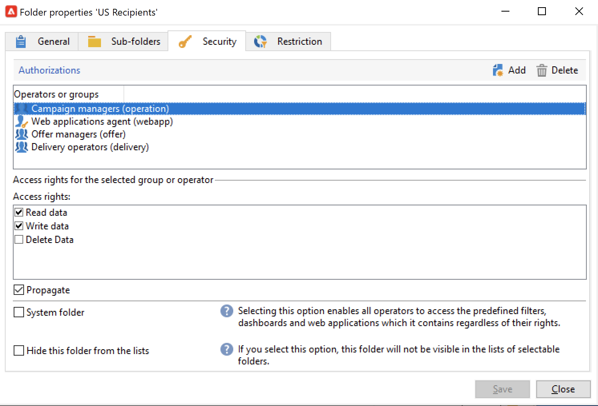

# Administrar permisos de carpeta{#manage-folder-permissions}

## Restringir el acceso a una carpeta{#restrict-access-to-a-folder}

Utilice permisos en las carpetas para organizar y controlar el acceso a los datos de Campaign.

La administración de carpetas se detalla en [esta página](../audiences/folders-and-views.md).

Para editar permisos en una carpeta de Campaign específica, siga los pasos a continuación:

1. Haga clic con el botón derecho en la carpeta y seleccione **[!UICONTROL Properties...]**.
1. Vaya a la pestaña **[!UICONTROL Security]** para ver las autorizaciones de esta carpeta.

   

* Para **autorizar un grupo o un operador**, haga clic en el botón **[!UICONTROL Add]** y seleccione el grupo u operador para asignar autorizaciones a esta carpeta.
* Para **prohibir un grupo o un operador**, haga clic en **[!UICONTROL Delete]** y seleccione el grupo u operador para quitar la autorización de esta carpeta.
* Para **seleccionar los derechos asignados a un grupo o a un operador**, seleccione el grupo u operador, seleccione los derechos de acceso que desee conceder y anule la selección de los demás.

>[!NOTE]
>
>No debería poder crear un objeto para el que no tenga al menos una carpeta con derechos de escritura.
>
>No necesita ser administrador para crear fragmentos, pero debe tener derechos de escritura en al menos una carpeta “Fragmento visual de contenido”. De lo contrario, no podrá crear un fragmento visual.

## Propagación de permisos {#propagate-permissions}

Para propagar autorizaciones y derechos de acceso, seleccione la opción **[!UICONTROL Propagate]** en las propiedades de la carpeta.

Las autorizaciones definidas en esta ventana se aplican a todas las subcarpetas del nodo actual. Siempre puede sobrecargar estas autorizaciones para cada una de las subcarpetas.

>[!NOTE]
>
>Al desmarcar la opción **[!UICONTROL Propagate]** de una carpeta, no se borra para las subcarpetas: debe borrarla explícitamente para cada una de las subcarpetas.

## Concesión de acceso a todos los operadores {#grant-access-to-all-operators}

En la ficha **[!UICONTROL Security]**, seleccione **[!UICONTROL System folder]** para permitir el acceso a todos los operadores, independientemente de sus permisos.

Si se borra esta opción, se debe volver a añadir explícitamente el operador (o su grupo) a la lista de autorizaciones para que tengan acceso.
