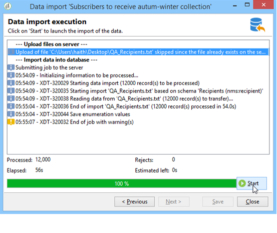
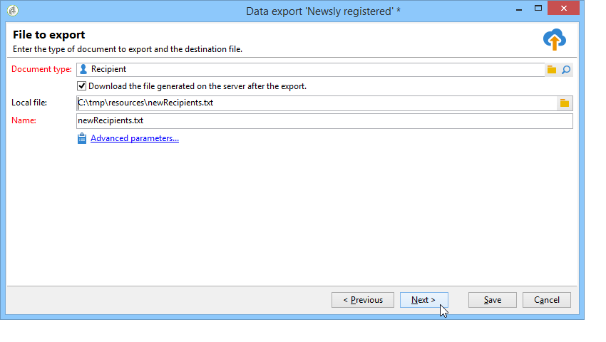

# Importación de datos en Campaign {#ootb-profiles}

Campaign le ayuda a añadir contactos a la base de datos de Cloud. Puede cargar un archivo, programar y automatizar varias actualizaciones de contacto, recopilar datos en la web o introducir información de perfil directamente en la tabla de destinatarios.

Introducción a los [públicos](audiences.md)

Explicación del [modelo de datos](../dev/datamodel.md) de Campaign

## Importación de perfiles en un flujo de trabajo

Las importaciones de perfil se configuran en plantillas dedicadas ejecutadas a través de flujos de trabajo mediante la actividad **Importación**. Se pueden repetir automáticamente según un programa, por ejemplo, para automatizar el intercambio de datos entre varios sistemas de información. Obtenga más información en [esta sección](../../automation/workflow/recurring-import-workflow.md).

## Ejecución de importaciones unitarias

Cree y ejecute un trabajo de importación de datos genérico para cargar contactos en la base de datos de Cloud.

### Importación de datos

Adobe Campaign permite importar datos a la base de datos desde uno o varios archivos de texto, CSV, TAB o formato XML. Estos archivos están asociados a una tabla (principal o vinculada) y cada campo del archivo de origen se asocia a un campo de la base de datos.

>[!NOTE]
>
>Puede importar datos sin asignarlos con los datos de la base de datos mediante la función **[!UICONTROL Import a list]**. Posteriormente, los datos se pueden utilizar exclusivamente en flujos de trabajo mediante el objeto **[!UICONTROL Read list]**. Para obtener más información, consulte [esta página](../../automation/workflow/read-list.md).

El asistente de importación permite configurar la importación, definir sus opciones (como la transformación de datos) e iniciar la ejecución. Es una serie de pantallas cuyo contenido depende del tipo de importación (simple o múltiple) y de los derechos del operador.

El asistente de importación se muestra después de crear un nuevo trabajo de importación.

>[!NOTE]
>
>Si utiliza un servidor Web IIS, puede requerir una configuración para autorizar la carga de archivos grandes (superiores a 28 MB).

#### Archivo de origen {#source-file}

En el archivo de origen, cada línea coincide con un registro. Los datos de los registros están separados por delimitadores (espacio, tabulación, carácter, etc.). Esto significa que los datos se recuperan en forma de columnas y cada columna está asociada a un campo de la base de datos.

## Paso 1: Selección de la plantilla de importación {#step-1---choosing-the-import-template}

Al iniciar el asistente de importación, primero debe seleccionar una plantilla. Por ejemplo, para configurar la importación de destinatarios que recibieron un boletín, siga los pasos a continuación:

1. Seleccione la carpeta **[!UICONTROL Profiles and Targets > Job > Generic imports and exports]**.
1. Haga clic en **Nuevo** y, a continuación, en **Importar** para crear la plantilla de importación.

   

1. Haga clic en la flecha a la derecha del campo **[!UICONTROL Import template]** para seleccionar la plantilla o haga clic en **[!UICONTROL Select link]** para explorar el árbol.

   La plantilla original es **[!UICONTROL New text import]**. Esta plantilla no debe modificarse, pero puede duplicarse para configurar una nueva plantilla según sus necesidades. De forma predeterminada, las plantillas de importación se guardan en el nodo **[!UICONTROL Profiles and targets > Templates > Job templates]**.

1. Introduzca un nombre para esta importación en el campo **[!UICONTROL Label]**. Puede añadir una descripción.
1. Seleccione el tipo de importación en el campo apropiado. Existen dos tipos de importación posibles: **[!UICONTROL Simple import]** para importar solo un archivo y **[!UICONTROL Multiple import]** para importar varios archivos en una sola ejecución.

   Para una importación múltiple, seleccione **[!UICONTROL Multiple import]** en la lista desplegable de **[!UICONTROL Import type]** en la primera pantalla del asistente de importación.

   

1. Especifique los campos que desea importar haciendo clic en **[!UICONTROL Add]**.

   

   Cada vez que se añade un archivo, se muestra la pantalla del asistente **[!UICONTROL File to import]**. Consulte la sección [Paso 2: Selección de archivos de origen](#step-2---source-file-selection) y siga los pasos del asistente para definir las opciones de importación como para una importación simple.

   >[!NOTE]
   >
   >Las importaciones múltiples solo deben abordar necesidades específicas y no se recomienda usarlas.

### Parámetros avanzados {#advanced-parameters}

El enlace **[!UICONTROL Advanced parameters]** permite acceder a las siguientes opciones:

* **[!UICONTROL General]** Ficha

   * **[!UICONTROL Stop execution if there are too many rejects]**

     Esta opción está seleccionada de forma predeterminada. Puede desmarcarlo si desea continuar ejecutando la importación independientemente del número de rechazos. De forma predeterminada, la ejecución se detiene si se rechazan las primeras 100 líneas.

   * **[!UICONTROL Trace mode]**

     Seleccione esta opción para supervisar la ejecución de la importación para cada línea.

   * **[!UICONTROL Start the job in a detached process]**

     Esta opción está seleccionada de forma predeterminada. Permite separar la ejecución de la importación para que no afecte a otros trabajos en curso en la base de datos.

   * **[!UICONTROL Do not update enumerations]**

     Seleccione esta opción para evitar enriquecer la lista de valores numéricos en la base de datos.

* **[!UICONTROL Variables]** Ficha

  Puede definir variables asociadas con el trabajo a las que pueden acceder los editores de consultas y los campos calculados. Para crear una variable, haga clic en **[!UICONTROL Add]** y utilice el editor de variables.

  >[!IMPORTANT]
  >
  >La pestaña **[!UICONTROL Variables]** solo se utiliza para la programación relacionada con los flujos de trabajo, y por tanto solo deben configurarla usuarios expertos.

## Paso 2: Selección de archivos de origen {#step-2---source-file-selection}

El archivo de origen puede estar en formato de texto (txt, csv, pestaña, ancho fijo) o xml.

La **[!UICONTROL Upload file on the server]** está seleccionada de forma predeterminada. Haga clic en la carpeta situada a la derecha del campo **[!UICONTROL Local file]** para buscar en el disco local y seleccione el archivo que desea importar. Puede desmarcar esta opción para introducir la ruta de acceso y el nombre del archivo que desea importar si se encuentra en el servidor.

Cuando haya especificado el archivo, puede ver sus datos en la sección inferior de la ventana haciendo clic en **[!UICONTROL Auto-detect format]**. Esta previsualización muestra las 200 primeras líneas del archivo de origen.

Utilice las opciones que se ofrecen en la parte superior de esta vista para configurar la importación. Los parámetros definidos a través de estas opciones se transfieren a la previsualización. Estas son las opciones disponibles:

* **[!UICONTROL Click here to change the file format...]** permite comprobar el formato del archivo y ajustar la configuración.
* **[!UICONTROL Update on server...]** permite transferir el archivo local al servidor. Esta opción solo está disponible si ha seleccionado **[!UICONTROL Upload file on the server]**.
* **[!UICONTROL Download]** está disponible solo si el archivo se ha cargado en el servidor.
* **[!UICONTROL Auto-detect format]** se utiliza para reiniciar el formato del origen de datos. Esta opción permite volver a aplicar los formatos originales a los datos con formato a través de la opción **[!UICONTROL Click here to change the file format...]**.
* El enlace **[!UICONTROL Advanced parameters]** permite filtrar los datos de origen y acceder a las opciones avanzadas. Desde esta pantalla, puede elegir importar solo parte del archivo. También puede definir un filtro, por ejemplo, para importar únicamente los usuarios de tipo “Candidato” o “Cliente”, según el valor de la línea correspondiente. Estas opciones solo deben utilizarlas usuarios expertos en JavaScript.

### Cambio del formato del archivo {#changing-the-file-format}

La opción **[!UICONTROL Click here to change the file format...]** permite dar formato a los datos del archivo de origen y, en concreto, especificar el separador de columnas y el tipo de datos de cada campo. Esta configuración se realiza a través de la siguiente ventana:

Este paso permite describir cómo se deben leer los valores de los campos del archivo. Por ejemplo, en el caso de una fecha, los datos Fecha o Fecha y Hora pueden asociarse a un formato (dd/mm/aaaa, dd/mm/aa, etc.). Si los datos de entrada no coinciden con el formato esperado, se producen rechazos durante la importación.

Puede ver el resultado de la configuración en la zona de previsualización en la parte inferior de la ventana.

Haga clic en **[!UICONTROL OK]** para guardar el formato y, a continuación, haga clic en **[!UICONTROL Next]** para ir al paso siguiente.

## Paso 3: Asignación de campos {#step-3---field-mapping}

Después, debe seleccionar el esquema de destino y asignar los datos de cada columna a los campos de la base de datos.

* El campo **[!UICONTROL Destination schema]** permite seleccionar el esquema en el que se deben importar los datos. Esta información es obligatoria. Haga clic en el icono **[!UICONTROL Select link]** para seleccionar uno de los esquemas existentes. Haga clic en **[!UICONTROL Edit link]** para mostrar el contenido de la tabla seleccionada.
* La tabla central muestra todos los campos definidos en el archivo de origen. Seleccione los campos que desea importar para asociar a ellos un archivo de destino. Estos campos se pueden asignar manualmente o automáticamente.

  Para asignar un campo manualmente, haga clic en la casilla de verificación para seleccionar el campo de origen y haga clic en la segunda columna para activar la celda correspondiente al campo seleccionado. A continuación, haga clic en el icono **[!UICONTROL Edit expression]** para mostrar todos los campos de la tabla actual. Seleccione el campo de destino y haga clic en **[!UICONTROL OK]** para validar la asignación.

  Para asociar automáticamente los campos de origen y los campos de destino, haga clic en el icono **[!UICONTROL Guess the destination fields]** a la derecha de la lista de campos. Los campos propuestos pueden modificarse si es necesario.

  >[!IMPORTANT]
  >
  >El resultado de esta operación siempre debe validarse antes de continuar con el paso siguiente.

* Puede aplicar una transformación a los campos importados. Para ello, haga clic en la celda de la columna **[!UICONTROL Transformation]** relacionada con el campo y seleccione la transformación que desee aplicar.

  

  >[!IMPORTANT]
  >
  >La transformación se aplica al momento de la importación. Sin embargo, si se han definido restricciones en el campo de destino (en el ejemplo anterior, en el campo @nombre), estas restricciones tienen prioridad.

* Puede añadir campos calculados mediante el icono adecuado, situado a la derecha de la tabla central. Los campos calculados permiten realizar transformaciones complejas, agregar columnas virtuales o combinar los datos de varias columnas. Consulte las siguientes secciones para obtener más detalles sobre las distintas posibilidades.

### Campos calculados {#calculated-fields}

Los campos calculados son columnas nuevas añadidas al archivo de origen y se calculan desde otras columnas. Los campos calculados se pueden asociar a los campos de la base de datos de Adobe Campaign. Sin embargo, las operaciones de reconciliación no son posibles en los campos calculados.

Existen cuatro tipos de campos calculados:

* **[!UICONTROL Fixed string]**: el valor del campo calculado es el mismo para todas las líneas del archivo de origen. Permite establecer el valor de un campo de los registros insertados o actualizados. Por ejemplo, puede establecer un marcador en “sí” para todos los registros importados.
* **[!UICONTROL String with JavaScript tags]**: el valor del campo calculado es una cadena de caracteres que contiene comandos de JavaScript.
* **[!UICONTROL JavaScript expression]**: el valor del campo calculado es el resultado de la evaluación de una función de JavaScript. El valor devuelto puede ser un número, una fecha, etc.
* **[!UICONTROL Enumeration]**: el valor del campo se atribuye de acuerdo con un valor contenido en el archivo de origen. El editor permite especificar la columna de origen e introducir la lista de valores numéricos, como en el siguiente ejemplo:

  

  La pestaña **[!UICONTROL Preview]** permite ver el resultado de la configuración definida. En este caso, se ha añadido la columna **[!UICONTROL Subscription]**. El valor se calcula desde el campo **Estado**.

  

#### Paso 4: Reconciliación {#step-4---reconciliation}

El paso de reconciliación del asistente de importación le permite definir el modo de reconciliación de los datos del archivo con los datos existentes en la base de datos, y también establecer las reglas de prioridad entre los datos del archivo y los datos de la base de datos. La ventana de configuración tiene este aspecto:

La sección central de la pantalla contiene un árbol con los campos y las tablas de la base de datos de Adobe Campaign a la que se importan los datos.

Hay opciones especiales disponibles para cada nodo (tabla o campo). Al hacer clic en el nodo correspondiente en la lista, a continuación aparecen sus parámetros y una breve descripción. El comportamiento definido para cada elemento se muestra en la columna **[!UICONTROL Behavior]** correspondiente.

#### Tipos de operación {#types-of-operation}

Debe definir el tipo de operación para cada tabla relacionada con la importación. Las siguientes operaciones están disponibles para el elemento principal de la base de datos:

* **[!UICONTROL Update or insertion]**: actualiza el registro si existe en la base de datos, y lo crea en caso contrario.
* **[!UICONTROL Insertion]**: inserta registros en la base de datos.
* **[!UICONTROL Update]**: actualiza solo los registros existentes (e ignora otros registros).
* **[!UICONTROL Reconciliation only]**: busca el registro en la base de datos, pero no realiza ninguna actualización. Por ejemplo, permite asociar la carpeta de destinatarios para su importación según una columna del archivo sin actualizar los datos de las carpetas.
* **[!UICONTROL Deletion]**: permite eliminar registros en la base de datos.

Las siguientes opciones están disponibles para cada campo de la tabla relacionada con la importación:

* **[!UICONTROL Update (empty) if source value is empty]**: en caso de una actualización, el valor del campo elimina el valor de la base de datos si el campo está vacío en el archivo de origen. De lo contrario, el campo de la base de datos se mantiene.
* **[!UICONTROL Update only if destination is empty]**: el valor del archivo de origen no sobrescribe el valor del campo de base de datos a menos que el campo de base de datos esté vacío. En ese caso, toma el valor del archivo de origen.
* **[!UICONTROL Update the field only when the record is inserted]**: durante una operación de actualización o inserción, solo se importan los registros de archivo de origen que son nuevos.

>[!NOTE]
>
>La definición de una clave de reconciliación siempre es **obligatoria**, excepto en el caso de la inserción sin anulación de duplicación.

#### Claves de reconciliación {#reconciliation-keys}

Se debe completar por lo menos una clave de reconciliación para administrar la deduplicación.

Una clave de reconciliación es un conjunto de campos utilizados para identificar un registro. Por ejemplo, para importar destinatarios, la clave de la reconciliación puede ser el número de cuenta, el campo “correo electrónico” o los campos “apellidos, nombre, compañía”, etc.

En este caso, para averiguar si una línea de un archivo coincide con un destinatario existente en la base de datos, el motor de importación compara los valores del archivo con los de la base de datos para todos los campos de la clave. Cuando los campos son específicos de un registro, se puede realizar una comparación aproximada entre los datos de origen y destino, garantizando la integridad de los datos tras la importación. Se puede rellenar una segunda clave de reconciliación para la misma tabla; se utiliza para las líneas cuya primera clave está vacía.

Evite elegir un campo que pueda modificarse durante la importación; si esto ocurre, el motor podría crear registros adicionales.

>[!NOTE]
>
>Para una importación de destinatario, el identificador de la carpeta seleccionada se añade implícitamente a la clave.
>
>Por lo tanto, la reconciliación solo se realiza en esta carpeta (a no ser que no se haya seleccionado ninguna carpeta).

#### Deduplicación {#deduplication}

>[!NOTE]
>
>Un “doble” es un elemento que existe dos o más veces en el archivo que desea importar.
>
>Un “duplicado” es un elemento que existe tanto en el archivo que desea importar como en la base de datos.

El campo **[!UICONTROL Management of doubles]** permite configurar la anulación de duplicación de datos. La deduplicación se aplica a los registros que aparecen varias veces **en el archivo de origen** (o archivos de origen en el caso de una importación de varios archivos), es decir, líneas en las que los campos de la clave de reconciliación son idénticos.

* La administración de duplicados en el modo **[!UICONTROL Update]** (modo predeterminado) no ejecuta la anulación de duplicación. Por tanto, el último registro tiene prioridad (porque actualiza los datos de los registros anteriores). En este modo no se realiza un recuento de duplicados.
* La administración de duplicados en el modo **[!UICONTROL Ignore]** o **[!UICONTROL Reject entity]** excluye los duplicados de la importación. En este caso, no se importa ningún registro.
* En el modo **[!UICONTROL Reject entity]**, el elemento no se importa y se genera un error en los registros de importación.
* En el modo **[!UICONTROL Ignore]**, el elemento no se importa, pero no se conserva un registro del error. Este modo permite optimizar el rendimiento.

>[!IMPORTANT]
>
>La deduplicación se realiza únicamente en la memoria. Por lo tanto, el tamaño de una importación con deduplicación es limitado. El límite depende de varios parámetros (capacidad del servidor de aplicaciones, actividad, cantidad de campos en la clave, etc.). El tamaño máximo de deduplicación es del orden de 1 000 000 de líneas.

La deduplicación afecta a un registro que está presente tanto en el archivo de origen como en la base de datos. Afecta solo a operaciones con actualización (es decir, **[!UICONTROL Update and insertion]** o **[!UICONTROL Update]**). La opción **[!UICONTROL Duplicate management]** permite actualizar o ignorar el registro si se encuentra en el archivo de origen y en la base de datos. La opción **[!UICONTROL Update or insert based on origin]** pertenece al módulo opcional y no se puede utilizar en un contexto estándar.

Las opciones **[!UICONTROL Reject]** e **[!UICONTROL Ignore]** funcionan como se ha mostrado anteriormente.

### En caso de errores {#behavior-in-the-event-of-an-error}

La mayoría de las operaciones de transferencia de datos generan varios tipos de errores (formato de línea incoherente, dirección de correo electrónico no válida, etc.). Todos los errores y todas las advertencias generadas por el motor de importación se almacenan y vinculan a la instancia de importación.

Los detalles de estos rechazos se pueden comprobar a través de la pestaña **[!UICONTROL Rejects]**.

Hay dos tipos de rechazos (el tipo se muestra en la columna **[!UICONTROL Connector]**):

* Los rechazos del conector de texto se refieren a errores que ocurren mientras se procesa la línea del archivo (campo calculado, análisis de datos, etc.). En este caso, en caso de error se rechaza siempre la línea entera.
* Los rechazos del conector de la base de datos se refieren a errores que ocurren durante la reconciliación de datos o la escritura en la base de datos. En el caso de una importación a varias tablas, el rechazo solo puede afectar a una parte del registro (por ejemplo, para una importación de destinatarios y eventos asociados, un error puede impedir la actualización de un evento sin rechazar el destinatario).

En la página de reconciliación de datos, puede definir el tipo de gestión de error deseado de forma individual para cada campo y para cada tabla.

* **[!UICONTROL Ignore and log a warning]**: todos los campos se importan en la base de datos, salvo el que generó un error.
* **[!UICONTROL Reject parent element]**: se rechaza toda la línea del registro, no solo el campo que provocó un error.
* **[!UICONTROL Reject all elements]**: la importación se detiene y todos los elementos del registro se rechazan.

  

El árbol de la pantalla de rechazo de una instancia de importación indica qué campos se rechazaron y dónde se produjeron los errores.

Puede generar un archivo que contenga estos registros mediante el icono **[!UICONTROL Export rejects]**:

#### Paso 5: Paso adicional al importar destinatarios {#step-5---additional-step-when-importing-recipients}

El siguiente paso del asistente de importación le permite seleccionar o crear la carpeta en la que se importan los datos, asignar automáticamente los destinatarios importados con una lista (nueva o existente) y suscribir destinatarios a un servicio.

>[!NOTE]
>
>Este paso aparece solo cuando se importan destinatarios y cuando se utiliza la tabla de destinatarios predeterminada de Adobe Campaign (**nms:destinatario**).

* Haga clic en los enlaces **[!UICONTROL Edit]** para seleccionar la carpeta, la lista o el servicio al que desee asociar o suscribir a los destinatarios.

   1. Importación en una carpeta.

      El vínculo **[!UICONTROL Edit...]** de la sección **[!UICONTROL Import into a folder]** permite seleccionar o crear la carpeta en la que se importan los destinatarios. De forma predeterminada, si no se define ninguna partición, los datos se importan a la carpeta predeterminada del operador.

      >[!NOTE]
      >
      >La carpeta predeterminada de un operador es la primera carpeta para la que el operador tiene acceso de escritura. Más información en [Administrar carpetas y vistas](../audiences/folders-and-views.md).

      Para seleccionar la carpeta de importación, haga clic en la flecha a la derecha del campo **[!UICONTROL Folder]** y seleccione la carpeta correspondiente. También puede utilizar el icono **[!UICONTROL Select link]** para mostrar el árbol en una nueva ventana o crear una carpeta nueva.

      

      Para crear una carpeta nueva, seleccione el nodo del que desea añadir una carpeta y haga clic con el botón derecho del ratón. Seleccione **[!UICONTROL Create a new 'Recipients' folder]**.

      

      La carpeta se crea debajo del nodo actual. Introduzca el nombre de la nueva carpeta, pulse Enter para confirmar y haga clic en **[!UICONTROL OK]**.

      

   1. Asociación con una lista.

      El enlace **[!UICONTROL Edit...]** la sección **[!UICONTROL Add recipients to a list]** permite seleccionar o crear una lista a la que se importan los destinatarios.

      

      Puede crear una lista nueva para estos destinatarios haciendo clic en **[!UICONTROL Select link]** y luego en **[!UICONTROL Create]**.

      

      Puede decidir añadir los destinatarios a los que ya están presentes en una lista o volver a crear la lista con los nuevos destinatarios. En este caso, si la lista ya contiene destinatarios, estos se eliminan y reemplazan por los destinatarios importados.

   1. Suscripción a un servicio

      Para suscribir a todos los destinatarios importados a un servicio informativo, haga clic en el vínculo **[!UICONTROL Edit...]** de la sección **[!UICONTROL Subscribe recipients to a service]** para seleccionar o crear el servicio informativo al que se deben suscribir los destinatarios. Puede seleccionar la opción **[!UICONTROL Send a confirmation message]** de confirmación: El contenido de este mensaje se define en la plantilla de entrega asociada al servicio de suscripción.

      

      Puede crear un nuevo servicio para estos destinatarios haciendo clic en **[!UICONTROL Select link]** y, luego, en el icono **[!UICONTROL Create]**. La administración de los servicios de información se presenta en [esta sección](../start/subscriptions.md).

* Utilice el campo **[!UICONTROL Origin]** para añadir información sobre el origen de los destinatarios a sus perfiles. Esta información es especialmente útil en el marco de una importación múltiple.

Haga clic en **[!UICONTROL Next]** para validar este paso y mostrar el siguiente paso.

## Paso 6: Inicio de la importación {#step-6---launching-the-import}

El último paso del asistente le permite iniciar la importación de datos. Para ello, haga clic en el botón **[!UICONTROL Start]**.

A continuación, puede supervisar la ejecución del trabajo de importación (consulte [Supervisión de la ejecución del flujo de trabajo](../../automation/workflow/monitor-workflow-execution.md)).

### Exportación de datos

Los trabajos de exportación permiten acceder a la base de datos y extraer datos de ella: contactos, clientes, listas, segmentos, etc.

Por ejemplo: puede resultar útil utilizar datos de seguimiento de campañas (historial de seguimiento, etc.) en una hoja de cálculo. Los datos de salida pueden estar en formato txt, CSV, TAB o formato XML.

El asistente de exportación permite configurar una exportación, definir sus opciones e iniciar la ejecución. Es una serie de pantallas cuyo contenido depende del tipo de exportación (simple o múltiple) y de los derechos del operador.

El asistente de exportación se muestra después de crear un nuevo trabajo de exportación.

#### Paso 1: Selección de la plantilla de exportación {#step-1---choosing-the-export-template}

Al iniciar el asistente de exportación, primero debe seleccionar una plantilla. Por ejemplo, para configurar la exportación de destinatarios que se hayan registrado recientemente, siga los pasos a continuación:

1. Seleccione la carpeta **[!UICONTROL Profiles and Targets > Job > Generic imports and exports]**.
1. Haga clic en **Nuevo** y, a continuación, en **Exportar** para crear la plantilla de exportación.

   

1. Haga clic en la flecha a la derecha del campo **[!UICONTROL Export template]** para seleccionar la plantilla o haga clic en **[!UICONTROL Select link]** para explorar el árbol.

   La plantilla original es **[!UICONTROL New text export]**. Esta plantilla no debe modificarse, pero puede duplicarla para configurar una nueva plantilla. De forma predeterminada, las plantillas de exportación se guardan en el nodo **[!UICONTROL Resources > Templates > Job templates]**.

1. Introduzca un nombre para la exportación en el campo **[!UICONTROL Label]**. Puede añadir una descripción.
1. Seleccione el tipo de exportación. Existen dos tipos posibles de exportación: **[!UICONTROL Simple export]** para exportar solo un archivo y **[!UICONTROL Multiple export]** para exportar varios archivos en una sola ejecución, desde uno o varios tipos de documento de origen.

## Paso 2: Tipo de archivo de exportación {#step-2---type-of-file-to-export}

Seleccione el tipo de documento que desea exportar, por ejemplo, el esquema de los datos que desea exportar.

De forma predeterminada, cuando se inicia la exportación desde el nodo **[!UICONTROL Jobs]**, los datos proceden de la tabla de destinatarios. Cuando se inicia la exportación desde una lista de datos (desde el menú **[!UICONTROL right click > Export]**), la tabla a la que pertenecen los datos se rellena automáticamente en el campo **[!UICONTROL Document type]**.

* La opción **[!UICONTROL Download the file generated on the server after the export]** está seleccionada de forma predeterminada. En el campo **[!UICONTROL Local file]**, indique el nombre y la ruta del archivo que va a crear o busque el disco local haciendo clic en la carpeta a la derecha del campo. Puede desmarcar esta opción para introducir la ruta de acceso y el nombre del archivo de salida del servidor.

  >[!NOTE]
  >
  >Los trabajos de importación y exportación automáticos siempre se realizan en el servidor.
  >
  >Para exportar solo algunos datos, haga clic en **[!UICONTROL Advanced parameters]** e introduzca en el campo correspondiente el número de líneas que desea exportar.

* Puede crear una exportación diferencial para exportar solo los registros que se han modificado desde la última ejecución. Para ello, haga clic en el vínculo **[!UICONTROL Advanced parameters]**, luego en la pestaña **[!UICONTROL Differential export]** y seleccione **[!UICONTROL Activate differential export]**.

  

  Debe especificar la fecha de la última modificación. Puede recuperarla de un campo o calcularla.

### Paso 3: Definición del formato de salida {#step-3---defining-the-output-format}

Seleccione un formato de salida para el archivo de exportación. Se pueden utilizar los siguientes formatos: texto, texto de ancho fijo, csv y xml.

* En el caso de los archivos de formato **[!UICONTROL Text]**, seleccione los delimitadores para separar las columnas (tabulaciones, comas, punto y coma o personalizado) y las cadenas (comillas simples o dobles, o ninguna).
* Para **[!UICONTROL text]** y **[!UICONTROL CSV]**, puede seleccionar la opción **[!UICONTROL Use first lines as column titles]**.
* Indique el formato de fecha y el formato de número. Para hacer esto, haga clic en el botón **[!UICONTROL Edit]** en el campo correspondiente y use el editor.
* En los campos que contienen valores numéricos, puede seleccionar **[!UICONTROL Export labels instead of internal values of enumerations]**. Por ejemplo, el título se puede almacenar en el formulario **1=Mr.**, **2=Miss**, **3=Mrs.**. Si se selecciona esta opción, se exportan **Mr.**, **Miss** y **Mrs.**

#### Paso 4: Selección de datos {#step-4---data-selection}

Seleccione los campos que desea exportar. Para ello:

1. Haga doble clic en los campos deseados en la lista **[!UICONTROL Available fields]** para añadirlos a la sección **[!UICONTROL Output columns]**.
1. Utilice las flechas de la derecha de la lista para definir el orden de los campos en el archivo de salida.

   

1. Haga clic en el botón **[!UICONTROL Add]** para llamar a las funciones.

#### Paso 5: Orden de las columnas {#step-5---sorting-columns}

Seleccione el orden de las columnas.

#### Paso 6: Condiciones de filtro {#step-6---filter-conditions-}

Puede añadir condiciones de filtro para evitar la exportación de todos los datos. La configuración de este filtro es la misma que la segmentación de destinatarios en el asistente de envíos.

#### Paso 7: Formato de datos {#step-7---data-formatting}

Puede modificar el orden y las etiquetas de los campos del archivo de salida y aplicar transformaciones a los datos de origen.

* Para cambiar el orden de las columnas que desea exportar, seleccione la columna y utilice las flechas azules a la derecha de la tabla.
* Para cambiar la etiqueta de un campo, haga clic en la celda de la columna **[!UICONTROL Label]** que corresponda con el campo que desea modificar e introduzca la etiqueta nueva. Pulse Enter en el teclado para confirmar.
* Para aplicar una transformación al contenido de un campo, selecciónelo en la columna **[!UICONTROL Transformation]**. Puede seleccionar:

   * Cambiar a minúsculas
   * Cambiar a mayúsculas
   * Primera letra en mayúsculas

  

* Haga clic en **[!UICONTROL Add a calculated field]** si desea crear un nuevo campo calculado (por ejemplo, una columna que contenga apellidos y nombre). Para obtener más información, consulte la sección Importar datos.

Si desea exportar una recopilación de elementos (por ejemplo, suscripciones de destinatarios, listas a las que pertenecen, etc.), debe especificar el número de elementos de la recopilación que desea exportar.

#### Paso 8: Previsualización de datos {#step-8---data-preview}

Haga clic en **[!UICONTROL Start the preview of the data]** para obtener una previsualización del resultado de la exportación. De forma predeterminada, se muestran las 200 primeras líneas. Para cambiar este valor, haga clic en las flechas a la derecha del campo **[!UICONTROL Lines to display]**.

Haga clic en las pestañas de la parte inferior del asistente para cambiar de la vista previa de los resultados en columnas a los resultados en XML. También puede ver las consultas SQL generadas.

#### Paso 9: Inicio de la exportación {#step-9---launching-the-export}

Haga clic en **[!UICONTROL Start]** para iniciar la exportación de datos.

A continuación, puede monitorizar la ejecución del trabajo de importación.

## Recopilación de perfiles mediante aplicaciones web

Utilice Campaign para crear formularios web y recopilar y administrar la información de perfil de forma fácil y eficaz. Puede compartir estos formularios en su sitio web, lo que facilita que sus contactos proporcionen su información. Su información se envía a Campaign para crear su perfil o actualizar su información si ya está presente en la base de datos.

Aprenda a crear formularios web en [Documentación de Campaign Classic v7](https://experienceleague.adobe.com/docs/campaign-classic/using/designing-content/web-forms/about-web-forms.html?lang=es){target="_blank"}.

**Temas relacionados**

* [Crear públicos](audiences.md)
* [Deduplicación de perfiles](../../automation/workflow/deduplication-merge.md)
* [Enriquecimiento de los datos de perfil](../../automation/workflow/enrich-data.md)
