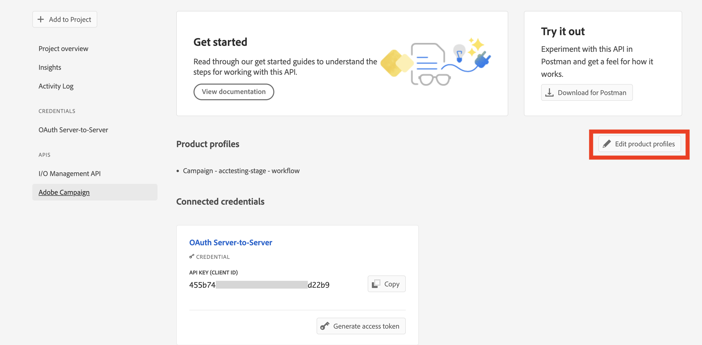

# Migración de los operadores técnicos de Campaign a la consola de Adobe Developer {#migrate-tech-users-to-ims}

A partir de la versión 8.5 de Campaign, se está mejorando el proceso de autenticación en la versión 8 de Campaign. Los operadores técnicos deben utilizar [Adobe Identity Management System (IMS)](https://helpx.adobe.com/es/enterprise/using/identity.html){target="_blank"} para conectarse a Campaign. Un operador técnico es un perfil de usuario de Campaign que se ha creado explícitamente para la integración de API. Este artículo detalla los pasos necesarios para migrar un operador técnico a una cuenta técnica en la consola de Adobe Developer.

## ¿Qué ha cambiado?{#ims-changes}

Los usuarios normales de Campaign ya se conectan a la consola de Adobe Campaign con su Adobe ID a través del Sistema Identity Management de Adobe (IMS). Como parte del esfuerzo por reforzar la seguridad y el proceso de autenticación, la aplicación del cliente de Adobe Campaign ahora llama a las API de Campaign directamente mediante el token de cuenta técnica de IMS.

Obtenga más información sobre el nuevo proceso de autenticación de servidor a servidor [en la documentación de la consola Adobe Developer](https://developer.adobe.com/developer-console/docs/guides/authentication/ServerToServerAuthentication/){target="_blank"}.

Este cambio es aplicable a partir de la versión 8.5 de Campaign y será **obligatorio** inicio de Campaign v8.6.


## ¿Se ha visto afectado?{#ims-impacts}

Si utiliza las API de Campaign, debe migrar los operadores técnicos a la consola de Adobe Developer como se detalla a continuación.

## ¿Cómo realizar la migración?{#ims-migration-procedure}

### Requisitos previos{#ims-migration-prerequisites}

Antes de iniciar el proceso de migración, debe ponerse en contacto con su representante de Adobe para que los equipos técnicos de Adobe puedan migrar los grupos de operadores existentes y los derechos asignados a Adobe Identity Management System (IMS).

### Paso 1: Creación/actualización del proyecto de Campaign en la consola de Adobe Developer{#ims-migration-step-1}

Las integraciones se crean como parte de un **Proyecto** en la consola de Adobe Developer. Más información sobre los Proyectos en [Documentación de la consola Adobe Developer](https://developer.adobe.com/developer-console/docs/guides/projects/){target="_blank"}.

Como usuario de Campaign v8, ya debería tener un proyecto en la consola de Adobe Developer. Si no es así, debe crear un proyecto. Los pasos para crear un proyecto se detallan [en la documentación de la consola Adobe Developer](https://developer.adobe.com/developer-console/docs/guides/getting-started/){target="_blank"}.

Una vez que tenga acceso al proyecto de Campaign, puede agregar servicios, incluidas las API, Adobe Campaign y la API de administración de I/O. Para esta migración, debe agregar las siguientes API en el proyecto: **API de administración de E/S** y **Adobe Campaign**.


### Paso 2: Añadir una API al proyecto mediante la autenticación de servidor a servidor{#ims-migration-step-2}

Una vez creado el proyecto en la consola de Adobe Developer, añada una API que utilice la autenticación de servidor a servidor. Obtenga información sobre cómo configurar la credencial de servidor a servidor OAuth en [en la documentación de la consola Adobe Developer](https://developer.adobe.com/developer-console/docs/guides/authentication/ServerToServerAuthentication/implementation/){target="_blank"}.

Cuando la API se haya conectado correctamente, puede acceder a las credenciales recién generadas, incluidos el ID de cliente y el Secreto de cliente, así como generar un token de acceso.

### Paso 3: Adición del perfil de producto al proyecto{#ims-migration-step-3}

Ahora puede añadir el perfil de producto de Campaign al proyecto, como se detalla a continuación:

1. Abra la API de Adobe Campaign.
1. Haga clic en **Edición de perfiles de producto** botón

   

1. Asigne todos los perfiles de producto relevantes a la API, por ejemplo &quot;centro de mensajes&quot;, y guarde los cambios.
1. Vaya a la **Detalles de credenciales** del proyecto y copie la pestaña **Correo electrónico de cuenta técnica** valor.

### Paso 4: Actualización del operador técnico en la consola del cliente {#ims-migration-step-4}

El último paso es actualizar el operador técnico en la consola del cliente de Adobe Campaign.

>[!CAUTION]
>
>Después de actualizar el tipo de autenticación para el operador técnico, todas las integraciones de API con este operador técnico dejarán de funcionar. Usted debe [actualizar las integraciones de API](#ims-migration-step-6).

Para actualizar el modo de autenticación del operador técnico a IMS, siga estos pasos:

1. Desde el explorador de la consola del cliente de Campaign, vaya a **Administración > Administración de acceso > Operadores**.
1. Edite el operador técnico existente utilizado para las API.
1. Reemplace el **Nombre (inicio de sesión)** de este operador técnico por el correo electrónico de la cuenta técnica recuperado anteriormente.
1. Vaya a la **Editar** botón situado en la parte superior izquierda al lado **Archivo** y seleccione **Editar el origen XML**.
1. Actualice el modo de autenticación a `ims`, como se indica a continuación:

   ```javascript
   <operator 
   ...
       <access authenticationType="ims" ...
       ...
       </access>
   ...
   </operator>
   ```

1. Guarde los cambios.

También puede actualizar el operador técnico mediante programación, utilizando secuencias de comandos SQL o API de Campaign. Estos modos le ayudan a automatizar los pasos que actualizan el nombre del operador con la dirección de correo electrónico de la cuenta técnica o el tipo de autenticación asociados.

* Utilice lo siguiente **Script SQL** para reemplazar el nombre del operador por el correo electrónico asociado:

   ```sql
   UPDATE xtkoperator
   SET sauthenticationtype = 'ims',
           sname = '{email}'
   WHERE sname = '{name}' AND itype = 0;
   ```

* Utilice lo siguiente `queryDef.ExecuteQuery` **API de Campaign** para recuperar el id de un operador para un operador técnico determinado:

   ```javascript
   <?xml version="1.0" encoding="utf-8"?>
   <soap:Envelope xmlns:soap="http://schemas.xmlsoap.org/soap/envelope/">
       <soap:Body>
           <ExecuteQuery xmlns="urn:xtk:queryDef">
               <sessiontoken>{session_token}</sessiontoken>
               <entity>
                   <queryDef schema="xtk:operator" operation="select">
                       <select>
                           <node expr="@id"/>
                       </select>
                       <where>
                           <condition expr="@name='{name}'"/>
                           <condition expr="@type=0"/>
                       </where>
                   </queryDef>
               </entity>
           </ExecuteQuery>
       </soap:Body>
   </soap:Envelope>
   ```

* Utilice lo siguiente `session.Write` **API de Campaign** para actualizar el nombre con la dirección de correo electrónico de la cuenta técnica especificada:

   ```javascript
   <?xml version="1.0" encoding="utf-8"?>
   <soap:Envelope xmlns:soap="http://schemas.xmlsoap.org/soap/envelope/">
       <soap:Body>
           <Write xmlns="urn:xtk:session">
               <sessiontoken>{session_token}</sessiontoken>
               <domDoc xsi:type='ns:Element' SOAP-ENV:encodingStyle='http://xml.apache.org/xml-soap/literalxml'>
                   <operator _operation="update" id="{id}" name="{email}" xtkschema="xtk:operator">
                       <access authenticationType="ims" />
                   </operator>
               </domDoc>
           </Write>
       </soap:Body>
   </soap:Envelope>
   ```

### Paso 5: Validación de la configuración {#ims-migration-step-5}

Para probar la conexión, siga los pasos detallados en la [Guía de credenciales de la consola Adobe Developer](https://developer.adobe.com/developer-console/docs/guides/authentication/ServerToServerAuthentication/implementation/#generate-access-tokens){target="_blank"} para generar un token de acceso y copiar el comando cURL de ejemplo proporcionado.


### Paso 6: Actualización de las integraciones de API de terceros {#ims-migration-step-6}

Debe actualizar las integraciones de la API con los sistemas de terceros.

Para obtener más información sobre los pasos de integración de la API, incluido un código de ejemplo para una integración sin problemas, consulte [Documentación de autenticación de la consola Adobe Developer](https://developer.adobe.com/developer-console/docs/guides/authentication/ServerToServerAuthentication/){target="_blank"}.


### Ejemplos de llamadas SOAP{#ims-migration-samples}

Una vez completado y validado el proceso de migración, las llamadas Soap se actualizan de la siguiente manera:

* Antes de la migración

   ```sql
   POST /nl/jsp/soaprouter.jsp HTTP/1.1
   Host: localhost:8080
   Content-Type: application/soap+xml;
   SOAPAction: "nms:rtEvent#PushEvent"
   charset=utf-8
   
   <?xml version="1.0" encoding="utf-8"?>  <soapenv:Envelope xmlns:soapenv="http://schemas.xmlsoap.org/soap/envelope/" xmlns:urn="urn:nms:rtEvent">
   <soapenv:Header/>
   <soapenv:Body>
       <urn:PushEvent>
           <urn:sessiontoken>SESSION_TOKEN</urn:sessiontoken>
           <urn:domEvent>
               <!--You may enter ANY elements at this point-->
               <rtEvent type="type" email="name@domain.com"/>
           </urn:domEvent>
       </urn:PushEvent>
   </soapenv:Body>
   </soapenv:Envelope>
   ```

* Después de la migración

   ```sql
   POST /nl/jsp/soaprouter.jsp HTTP/1.1
   Host: localhost:8080
   Content-Type: application/soap+xml;
   SOAPAction: "nms:rtEvent#PushEvent"
   charset=utf-8
   Authorization: Bearer <IMS_Technical_Token_Token>
   
   <?xml version="1.0" encoding="utf-8"?>  <soapenv:Envelope xmlns:soapenv="http://schemas.xmlsoap.org/soap/envelope/" xmlns:urn="urn:nms:rtEvent">
   <soapenv:Header/>
   <soapenv:Body>
       <urn:PushEvent>
           <urn:sessiontoken></urn:sessiontoken>
           <urn:domEvent>
               <!--You may enter ANY elements at this point-->
               <rtEvent type="type" email="name@domain.com"/>
           </urn:domEvent>
       </urn:PushEvent>
   </soapenv:Body>
   </soapenv:Envelope>
   ```
