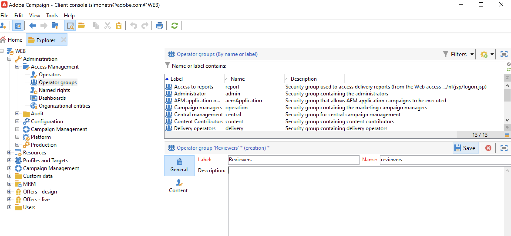

# Administrar permisos de usuario{#manage-permissions}

## Adición de usuarios {#add-users}

Como administrador de productos, puede añadir usuarios y conceder acceso a Campaign.

Para agregar un usuario, siga los pasos a continuación:

1. En la página de inicio de [Admin Console](https://adminconsole.adobe.com/enterprise){target="_blank"}, seleccione **Agregar usuarios**.

   

1. Introduzca la dirección de correo electrónico del usuario.
1. Utilice el signo &quot;+&quot; para seleccionar los perfiles de producto o los grupos de usuarios que desea asignar al usuario.

   

   Los perfiles de producto integrados de Campaign se enumeran en [esta sección](#ootb-productprofiles).

   Aprenda a crear grupos de usuarios en [esta sección](#user-groups)

1. Haga clic en **Save**. Se añade el usuario y se muestra en la lista Usuarios. Si asigna una función de administrador o un perfil de producto a los usuarios, estos recibirán una notificación por correo electrónico. Los usuarios deben seguir el vínculo para completar su perfil.

Obtenga más información acerca de la creación de usuarios en el Admin Console de [esta página](https://helpx.adobe.com/ie/enterprise/using/manage-users-individually.html){target="_blank"}.

Cuando los usuarios nuevos [inician sesión en Campaign](connect.md) con su Adobe ID, se agregan a la lista de operadores de Campaign en la consola del cliente. Los operadores de campaña se almacenan en la carpeta **[!UICONTROL Administration > Access management > Operators]** del explorador de campañas.

## Trabajo con perfiles de producto{#product-profiles}

Utilice perfiles de producto para otorgar a los usuarios las funciones incluidas en el producto.

* Para cada producto del Admin Console, puede crear uno o más perfiles de producto.
* En cada perfil de producto, se asignan usuarios y grupos de usuarios (en su organización).
* Cuando un usuario inicia sesión con sus credenciales según se especifican en el perfil del producto, se le concede acceso a las aplicaciones y servicios del producto en el que se basa el perfil del producto.

Estos perfiles de producto coinciden con los grupos de operadores que se almacenan en la carpeta **[!UICONTROL Administration > Access management > Operator groups]** del explorador de Campaign.

En el Admin Console, los perfiles de producto utilizan la siguiente sintaxis:

campaign - `<your instance>` - nombre interno del grupo de operadores

Por ejemplo, para el grupo **Operador de envío** de la instancia &quot;prueba&quot;, el perfil de producto del Admin Console es:

campaign - test - delivery

Puede utilizar perfiles de producto predeterminados o crear nuevos.

### Creación de un perfil de producto{#create-product-profile}

Para añadir un nuevo perfil de producto al Adobe, primero debe crearlo en la consola del cliente de Campaign y, a continuación, agregarlo en el Admin Console.

Por ejemplo, para crear un perfil de producto &quot;revisores&quot;, siga los pasos a continuación.

#### Creación del grupo de operadores en Campaign{#create-op-group}

1. Conéctese a Campaign, abra el Explorador y vaya a **[!UICONTROL Administration > Access management > Operator groups]**.
1. Haga clic en **[!UICONTROL New]**, y defina el nombre del grupo de operadores y su nombre interno (&quot;revisores&quot;).
   
1. Defina los permisos asociados seleccionando derechos asignados. Los derechos asignados se detallan en [esta sección](#use-named-rights)
1. Guarde el nuevo grupo de operadores.

#### Cree el perfil de producto en el Admin Console{#create-profile-in-admin-console}

1. Conectar con el [Admin Console](https://adminconsole.adobe.com/enterprise){target="_blank"}.
1. En la sección **Productos y servicios** de la página de inicio, abra el producto de Campaign.
1. Haga clic en **Nuevo perfil** e introduzca el nombre del perfil de producto que desea crear, con la sintaxis exacta correcta tal como se explica [aquí](#product-profiles). Para nuestro ejemplo, ingresamos: campaign - `<your-instance-name>` - reviewers

   

1. Guarde los cambios.

Ahora puede agregar usuarios a este nuevo perfil de producto, como se explica en [esta sección](#add-users).

Una práctica recomendada es asignar perfiles de producto a grupos de usuarios. La administración de permisos por parte de los usuarios no es un modelo sostenible.

### Perfiles de producto y grupos de operadores predeterminados {#ootb-productprofiles}

Adobe Campaign incluye **perfiles de producto** integrados que se definen cuando el Adobe habilita su entorno.

Estos perfiles de producto coinciden con los **grupos de operadores** de Campaign. Los grupos de operadores predeterminados y sus [derechos asignados](#use-named-rights) se enumeran a continuación:

1. **[!UICONTROL Administrator]** (administrador)

   Los operadores de este grupo tienen acceso completo a la instancia. Los administradores son usuarios que pueden acceder a las partes más técnicas de la interfaz de usuario.

   Este grupo contiene el siguiente derecho asignado:

   * **[!UICONTROL ADMINISTRATION]**: derecho a ejecutar, crear, editar o eliminar cualquier objeto, como flujo de trabajo, envío, secuencias de comandos, etc.

1. **[!UICONTROL Delivery operators]** (envío)

   Los operadores de este grupo están a cargo de la administración de las entregas: permiten el acceso a los recursos principales necesarios para crear y preparar entregas (tipologías de campaña, asignaciones de entregas, plantillas predeterminadas, bloques de personalización, etc.).

   Este grupo contiene los siguientes derechos asignados:

   * **[!UICONTROL PREPARE DELIVERIES]**: derecho a crear, editar e iniciar el análisis de envíos.
   * **[!UICONTROL START DELIVERIES]**: derecho a aprobar los envíos analizados previamente.

1. **[!UICONTROL Campaign managers]** (operación)

   Los operadores de este grupo pueden administrar las campañas de marketing: permite acceder a los objetos vinculados a campañas (planes, programas, flujos de trabajo, presupuestos, etc.) en el marco de **[!UICONTROL Campaign]** (módulo Adobe Campaign opcional).

   Este grupo contiene los siguientes derechos asignados:

   * **[!UICONTROL INSERT FOLDERS]**: derecho a insertar carpetas en el árbol de Adobe Campaign (siempre que tenga derechos de edición para las ramas correspondientes).
   * **[!UICONTROL WORKFLOW]**: derecho a utilizar flujos de trabajo.

   >[!NOTE]
   >
   >Este grupo no permite a los operadores iniciar entregas.

1. **[!UICONTROL Content contributors]** (contenido)

   Los usuarios de este grupo pueden tener acceso a las carpetas de contenido en el contexto del complemento **[!UICONTROL Content management]**. Este grupo no concede permisos adicionales.

1. **[!UICONTROL Access to reports]** (informe)

   Este grupo está reservado para operadores externos, para acceder a los informes de envío a través de un [acceso web](../start/campaign-ui.md#web-browser).

1. **[!UICONTROL Workflow execution]** (flujo de trabajo)

   El grupo **[!UICONTROL Workflow execution]** permite controlar la ejecución y la aprobación de los flujos de trabajo de objetivo: el derecho denominado “WORKFLOW” se asigna a los operadores de este grupo. Es necesario para todas las acciones relacionadas con los flujos de trabajo, además de los derechos de acceso a los archivos de datos. De forma predeterminada, el grupo **[!UICONTROL Workflow execution]** tiene acceso de solo lectura a los archivos de flujo de trabajo de objetivo estándar y a las plantillas de flujo de trabajo. Los operadores de este grupo también tienen acceso de lectura y escritura al archivo de aprobaciones pendientes.

1. **[!UICONTROL Workflow supervisors]** (workflowSupervisor)

   Los usuarios de este grupo administran las aprobaciones del flujo de trabajo y reciben una notificación por correo electrónico en caso de alertas relacionadas con los flujos de trabajo de campaña.

1. **Administración local/central** (central/local)

   Los usuarios de este grupo pueden usar el complemento **[!UICONTROL Distributed marketing]**.

1. **[!UICONTROL Offer managers]** (oferta)

   Los operadores de este grupo pueden crear y mantener ofertas al utilizar el complemento de interacción. [Más información](../interaction/interaction-operators.md).

   Este grupo contiene los siguientes derechos asignados:

   * **[!UICONTROL INSERT FOLDERS]**: derecho a insertar carpetas en el árbol de Adobe Campaign (siempre que tenga derechos de edición para las ramas correspondientes).
   * **[!UICONTROL EDIT FOLDERS]**: Derecho a modificar propiedades de carpeta como nombre interno, etiqueta, imagen asociada, orden de subcarpeta, etc.

   Los permisos asignados a los administradores de ofertas permiten realizar las siguientes tareas:

   * Modificar entornos **[!UICONTROL Design]**.
   * Ver entornos **[!UICONTROL Live]**.
   * Configure las funciones de administración (espacios predefinidos y filtros).
   * Cree y actualice categorías.
   * Cree ofertas.
   * Configurar la idoneidad de la oferta.
   * Aprobar ofertas.

   >[!NOTE]
   >
   >**Los administradores de ofertas** solo pueden aprobar una oferta si no se especifica ningún revisor o si se han establecido como revisores en la plantilla de oferta.

   La matriz de permisos del administrador de ofertas por entorno está disponible en [esta página](../interaction/interaction-operators.md#recap-of-rights-according-to-operator).

## Trabajar con grupos de usuarios{#user-groups}

Puede utilizar el Admin Console para crear grupos de usuarios y asignarles usuarios.

Un grupo de usuarios es una colección de usuarios diferentes a los que se debe otorgar un conjunto compartido de permisos. Aprenda a crear grupos de usuarios en [esta sección](https://helpx.adobe.com/ie/enterprise/using/user-groups.html){target="_blank"}.

Puede asignar perfiles de producto a grupos de usuarios. Por lo tanto, todos los usuarios de ese grupo deben recibir el mismo conjunto de permisos de producto.

## Derechos asignados{#use-named-rights}

Adobe Campaign incluye un conjunto de derechos asignados que permiten definir los permisos asignados a usuarios y grupos de usuarios. Estos derechos se pueden editar desde la carpeta **[!UICONTROL Administration > Access management > Named rights]** del explorador de Campaign.

Derechos asignados: Conceda permisos a:

* Realizar operaciones
Por ejemplo, el botón **Analizar** del editor de envíos está activado para los miembros del grupo **Operador de envíos** que tienen el derecho asignado **Preparar envío**

* Acceso a carpetas
La pertenencia a grupos de operadores puede conceder o restringir derechos de acceso a las carpetas cambiando la configuración de seguridad de las carpetas. [Más información](folder-permissions.md#restrict-access-to-a-folder).

  Por ejemplo, puede afectar a: **Acceso de escritura** para crear nuevas entidades (como envíos, perfiles, etc.), **Acceso de lectura** para usar entidades, **Acceso de eliminación** para eliminar entidades.

Los derechos asignados predeterminados en Adobe Campaign son:

* **[!UICONTROL ADMINISTRATION]**: Los operadores con el derecho de **[!UICONTROL ADMINISTRATION]** tienen acceso total a la instancia. Los usuarios administradores pueden ejecutar, crear, editar o eliminar cualquier objeto, como flujo de trabajo, envío, secuencias de comandos, etc.

* **[!UICONTROL APPROVAL ADMINISTRATION]**: Puede definir varios pasos de aprobación dentro de flujos de trabajo y envíos para asegurarse de que un operador o grupo asignado ha aprobado el estado actual. Los usuarios con el derecho de **[!UICONTROL APPROVAL ADMINISTRATION]** pueden definir los pasos de aprobación y también asignar un operador o grupo de operadores que deben aprobar dichos pasos.

* **[!UICONTROL CENTRAL]**: derecho para la administración central (Marketing distribuido).

* **[!UICONTROL DELETE FOLDER]**: derecho para eliminar carpetas. Con este derecho, los usuarios pueden eliminar carpetas de la vista de Explorer.

* **[!UICONTROL EDIT FOLDERS]**: Derecho a modificar propiedades de carpeta como nombre interno, etiqueta, imagen asociada, orden de subcarpeta, etc.

* **[!UICONTROL EXPORT]**: Los usuarios pueden exportar datos de sus instancias de Adobe Campaign a un archivo del servidor o del equipo local mediante la actividad de flujo de trabajo **[!UICONTROL EXPORT]**.

* **[!UICONTROL FILES ACCESS]**: Derecho de lectura y escritura de archivos mediante una secuencia de comandos que se puede escribir en la actividad de flujo de trabajo **[!UICONTROL JavaScript]** para leer y escribir archivos en un servidor. 

* **[!UICONTROL IMPORT]**: derecho para importar datos genéricos. **[!UICONTROL IMPORT]** permite importar datos en cualquier otra tabla, mientras que el derecho de **[!UICONTROL RECIPIENT IMPORT]** permite importarlos únicamente en la tabla de destinatarios.

* **[!UICONTROL INSERT FOLDERS]**: derecho para insertar carpetas. Los usuarios con el derecho de **[!UICONTROL INSERT FOLDERS]** pueden crear nuevas carpetas en el árbol de carpetas en la vista de Explorer.

* **[!UICONTROL LOCAL]**: derecho para la administración local (Distributed Marketing).

* **[!UICONTROL MERGE]**: Derecho para combinar los registros seleccionados en uno. Si los destinatarios existen como duplicados, el derecho de **[!UICONTROL MERGE]** permite al usuario seleccionar los duplicados y combinarlos en un destinatario principal.

* **[!UICONTROL PREPARE DELIVERIES]**: Derecho a crear, editar y guardar un envío. Los usuarios con el derecho de **[!UICONTROL PREPARE DELIVERIES]** también pueden iniciar el proceso de análisis de envíos.

* **[!UICONTROL PRIVACY DATA RIGHT]**: Derecho a recopilar y eliminar datos de privacidad. [Más información](privacy.md).

* **[!UICONTROL PROGRAM EXECUTION]**: Derecho a ejecutar comandos en diversos lenguajes de programación.

* **[!UICONTROL RECIPIENT IMPORT]**: derecho para importar destinatarios. Los usuarios con el derecho de **[!UICONTROL RECIPIENT IMPORT]** pueden importar un archivo local a la tabla de destinatarios.

* **[!UICONTROL SQL SCRIPT EXECUTION]** Derecho a ejecutar cualquier comando SQL directamente en la base de datos.

* **[!UICONTROL START DELIVERIES]**: derecho a aprobar los envíos analizados previamente. Después del análisis de envío, el envío se detiene en varios pasos de aprobación y debe aprobarse para reanudarse. Los usuarios con derecho a **[!UICONTROL START DELIVERIES]** pueden aprobar envíos.

* **[!UICONTROL USE SQL DATA MANAGEMENT ACTIVITY]**: derecho para escribir sus propias secuencias de comandos SQL con la actividad Administración de datos SQL para crear y rellenar tablas de trabajo. [Más información](../../automation/workflow/sql-data-management.md).

* **[!UICONTROL WORKFLOW]**: este derecho asignado es específico de los flujos de trabajo: permite crear, iniciar y detener flujos de trabajo. Se necesitan derechos de lectura en el archivo de flujo de trabajo para que el derecho llamado sea aplicable. Para flujos de trabajo de destino, es necesario tener derechos de lectura sobre la carpeta **[!UICONTROL Profiles and Targets]**.

* **[!UICONTROL WEBAPP]**: derecho para utilizar aplicaciones web.

>[!NOTE]
>
>Esta lista puede variar según los complementos instalados en el entorno.

## Recursos adicionales{#additional-res}

* [Administración de permisos para flujos de trabajo](../../automation/workflow/managing-rights.md)
* [Administración de permisos para marketing distribuido](../../automation/distributed-marketing/about-distributed-marketing.md#operators)
* [Administración de permisos para el módulo de interacción](../interaction/interaction-operators.md)
* [Filtro del acceso a los esquemas](../dev/filter-schema.md)
* [Restringir la vista IP](../dev/restrict-pi-view.md)
