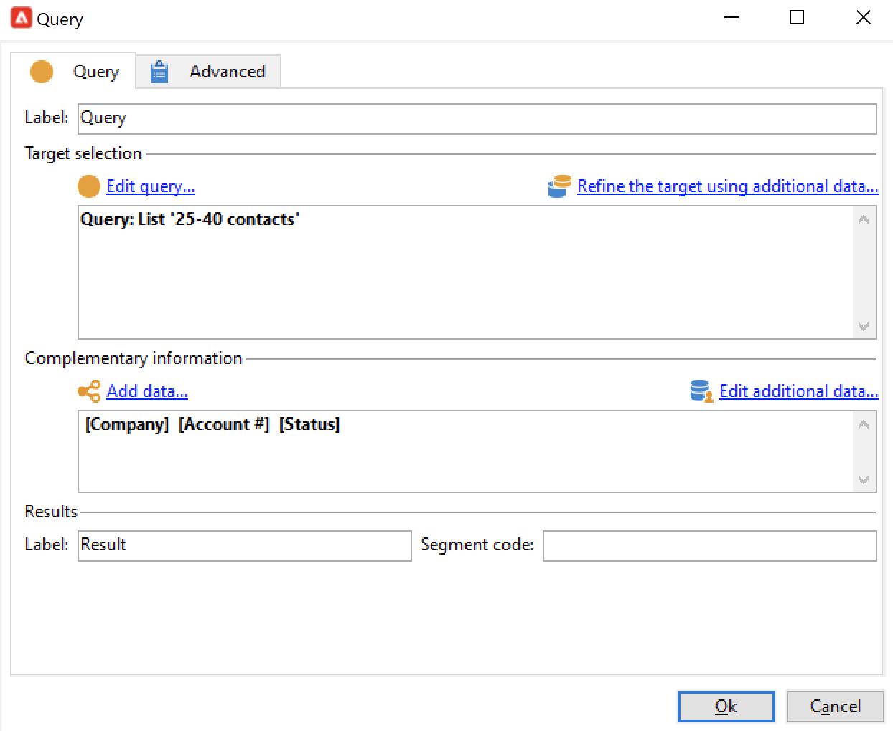
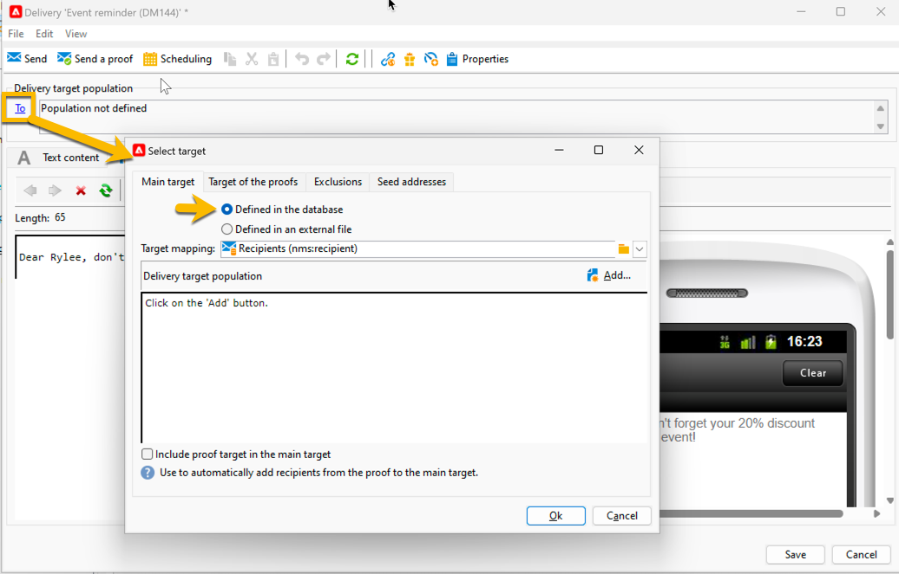
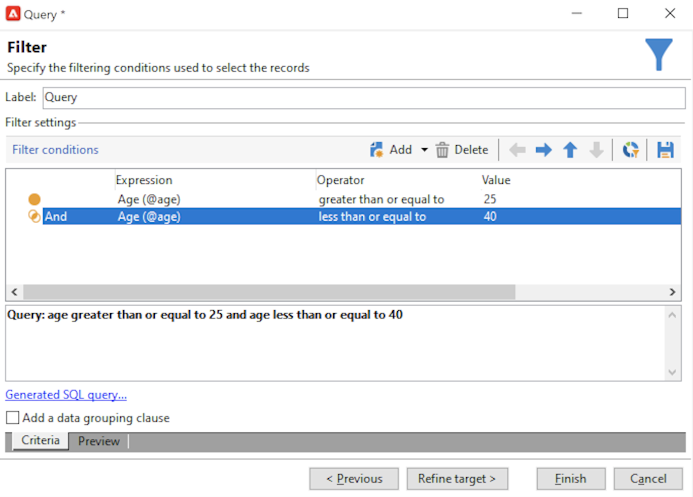

# Base de datos de Query Campaign

La herramienta de consulta está disponible en varios niveles de la aplicación y se puede utilizar para definir las poblaciones de público destinatario, segmentar clientes, extraer y filtrar registros de seguimiento, crear filtros, etc.

Proporciona un asistente dedicado (el editor de consultas genérico) accesible desde el menú **[!UICONTROL Tools > Generic query editor...]**. Este editor permite que las consultas de base de datos extraigan, organicen, agrupen y ordenen la información. Por ejemplo, puede recuperar los destinatarios que hicieron clic más de n veces en un vínculo de Newsletter durante un periodo determinado.

El editor de consultas genérico centraliza todas las funcionalidades de consulta. Permite crear y almacenar filtros de restricción, que luego se pueden reutilizar en otros contextos, como el cuadro de consulta de un flujo de trabajo de segmentación.

Los pasos para crear una consulta se detallan [en esta página](design-queries.md).

<!--
Contexts to use the query editor iin Campaign are listed below:

|Usage|Example|
|  ---  |  ---  |
|**Define a Query activity in a workflow**: Define the criteria to query Campaign database in a workflow. [Learn how to configure the Query activity](../../automation/workflow/query.md)|{width="200" align="center" zoomable="yes"}|
|**Define audiences**: Specify the population you want to target in your messages, and effortlessly create new audiences tailored to your needs. [Learn how to build audiences](../start/create-message.md#define-the-target-audience)|{width="200" align="center" zoomable="yes"}|
|**Define audiences**: Specify the population you want to target in your messages or workflows, and effortlessly create new audiences tailored to your needs. [Learn how to build audiences](../audiences/create-audiences.md)|{width="200" align="center" zoomable="yes"}|
|**Customize workflow activities**: Apply rules within workflow activities, such as **Split** and **Reconciliation**, to align with your specific requirements. [Learn more about workflow activities](../../automation/workflow/activities.md)|{width="200" align="center" zoomable="yes"}|
|**Predefined filters**: Create predefined filters that serve as shortcuts during various filtering operations, whether you're working with data lists or forming the audience for a delivery. [Learn how to work with predefined filters](../get-started/predefined-filters.md)|{width="200" align="center" zoomable="yes"}|
|**Filter reports data**: Add rules to filter the data displayed in reports. [Learn how to work with reports](../reporting/gs-reports.md)|{width="200" align="center" zoomable="yes"}|
|**Customize lists**: Create custom rules to filter the data displayed in lists such as recipients or deliveries lists. [Learn how to filter lists](../get-started/list-filters.md#list-built-in-filters)|{width="200" align="center" zoomable="yes"}|
|**Build conditional content**: Make email content dynamic by creating conditions that define which content should be displayed to different recipients, ensuring personalized and relevant messaging. [Learn how to build conditional content](../personalization/conditions.md)|{width="200" align="center" zoomable="yes"}|
-->

**Temas relacionados**

* [Actividad de consulta de flujo de trabajo](../../automation/workflow/query.md)
* [Consulta de la tabla de destinatarios](../../automation/workflow/querying-recipient-table.md)
* [Condiciones de filtrado](filter-conditions.md)
