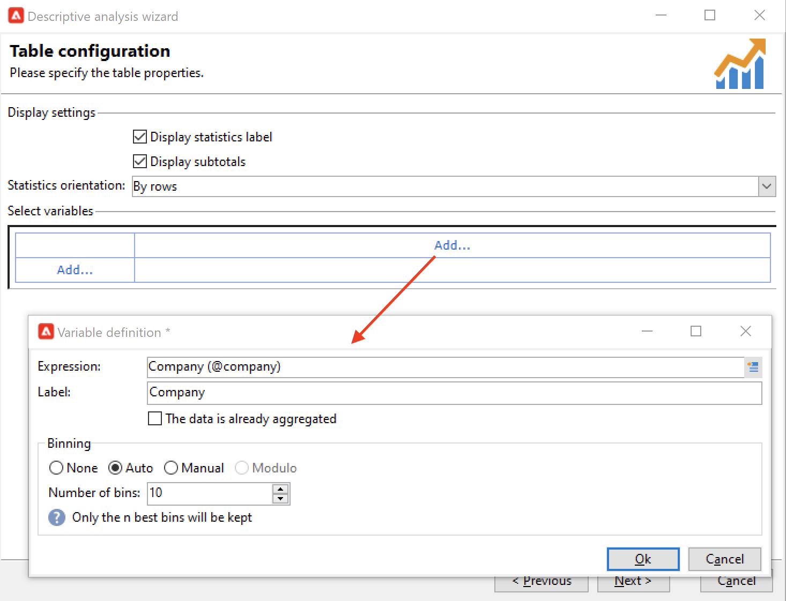

# Métricas e informes

## Introducción a la creación de informes{#gs-ac-reports}

Adobe Campaign proporciona un conjunto de herramientas de creación de informes que se enumeran en esta página.

* **Informes integrados**

   Adobe Campaign incluye informes sobre envíos, campañas, actividades de plataforma, capacidades opcionales, etc. Estos informes están disponibles a través de las diversas funciones a las que se refieren. Pueden adaptarse a sus necesidades específicas.

   Utilice la variable **Informes** para acceder a estos informes.

   

    Los informes integrados de Campaign se presentan en [Documentación de Campaign Classic v7](https://experienceleague.adobe.com/docs/campaign-classic/using/reporting/accessing-built-in-reports/about-campaign-built-in-reports.html){target=&quot;_blank&quot;}

* **Análisis de datos descriptivos**

   Adobe Campaign proporciona una herramienta visual para generar estadísticas de los datos de la base de datos. Puede crear informes de análisis descriptivos con un asistente dedicado y adaptar su contenido y diseño según sus necesidades.

   Utilice la variable **[!UICONTROL Tools > Descriptive analysis...]** para crear un nuevo informe.

   

    Los informes de análisis descriptivo de la campaña se presentan en [Documentación de Campaign Classic v7](https://experienceleague.adobe.com/docs/campaign-classic/using/reporting/analyzing-populations/about-descriptive-analysis.html){target=&quot;_blank&quot;}

* **Informes personalizados**

   Utilice Adobe Campaign para crear informes sobre los datos de la base de datos. Una vez creadas, haga que sean accesibles en los contextos correspondientes.

    Los pasos para crear un informe se detallan en [Documentación de Campaign Classic v7](https://experienceleague.adobe.com/docs/campaign-classic/using/reporting/creating-new-reports/about-reports-creation-in-campaign.html){target=&quot;_blank&quot;}. La creación de informes personalizados está reservada para usuarios avanzados.

* **Cubos**

   Analice y mida los datos, calcule las estadísticas, simplifique y optimice la creación y el cálculo de informes con Cubos.  Puede ampliar las capacidades de análisis y exploración de bases de datos y facilitar a los usuarios finales la configuración de informes y tablas. Todo lo que deben hacer es seleccionar un cubo existente (completamente configurado) al crear su informe o tabla para procesar cálculos, medidas y estadísticas.

   

   Según la complejidad de las consultas, los cálculos y los volúmenes, los datos analizados en estos informes se pueden recopilar mediante una consulta y preacumular en una lista (flujo de trabajo de tipo de gestión de datos) o en un cubo (mediante Marketing Analytics). Se muestra en forma de tabla dinámica o lista de grupos.

    Aprenda a crear cubos en [Documentación de Campaign Classic v7](https://experienceleague.adobe.com/docs/campaign-classic/using/reporting/designing-reports-with-cubes/about-cubes.html){target=&quot;_blank&quot;}

Tenga en cuenta que los informes de Adobe Campaign están optimizados y ofrecen mejores prestaciones de escalado que Campaign Classic v7. Las limitaciones existentes en Cubos no se aplican.
