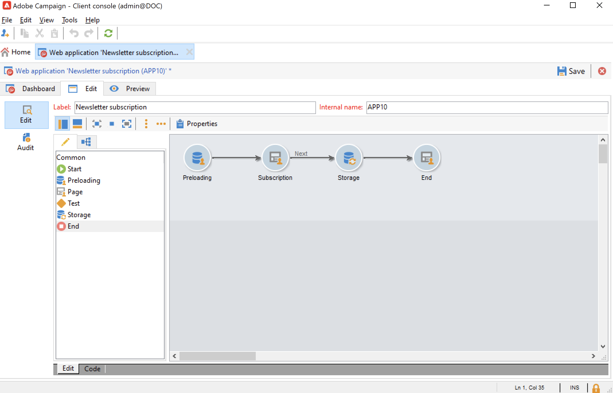

# Administración de suscripciones y bajas {#optin-optout}

Utilice Adobe Campaign para crear y supervisar sus servicios informativos, como los boletines informativos, y para gestionar las suscripciones o bajas de suscripción a estos servicios. Se pueden definir varios servicios en paralelo, como, por ejemplo: boletines de prueba para determinadas categorías de productos, temas o áreas de un sitio web, suscripciones a diversos tipos de mensajes de alerta y notificaciones en tiempo real.

Aprenda a crear un servicio informativo, enviar una newsletter y administrar la inclusión y la exclusión en la [documentación de Campaign Classic v7](https://experienceleague.adobe.com/docs/campaign-classic/using/sending-messages/subscriptions-and-referrals/managing-subscriptions.html?lang=es){target="_blank"}

Para suscribir (opt-in) un perfil a un servicio, las opciones disponibles son:

* Agregue manualmente el servicio al perfil de destinatario: para ello, desde la pestaña **[!UICONTROL Subscriptions]** de su perfil, haga clic en **[!UICONTROL Add]** y seleccione el servicio informativo que corresponda.

  

  Obtenga más información en la [documentación de Campaign Classic v7](https://experienceleague.adobe.com/docs/campaign-classic/using/getting-started/profile-management/editing-a-profile.html?lang=es#deliveries-tab){target="_blank"}

* Suscribir automáticamente a un conjunto de destinatarios al servicio. La lista de destinatarios puede proceder de una operación de filtrado, un grupo, una carpeta, una importación o una selección manual directa. Para suscribir a estos destinatarios, haga clic con el botón derecho del ratón. Seleccione **[!UICONTROL Actions > Subscribe selection to a service...]**.

  

  Seleccione el servicio correspondiente e inicie la operación.

  

  Obtenga más información en la [documentación de Campaign Classic v7](https://experienceleague.adobe.com/docs/campaign-classic/using/getting-started/profile-management/editing-a-profile.html?lang=es#deliveries-tab){target="_blank"}

* Importación de destinatarios y subscripción automática a un servicio informativo. Para ello, seleccione el servicio correspondiente en el último paso del asistente para importar.

  Obtenga más información en [Documentación de Campaign Classic v7](https://experienceleague.adobe.com/docs/campaign-classic/using/getting-started/importing-and-exporting-data/generic-imports-exports/executing-import-jobs.html?lang=es#step-5---additional-step-when-importing-recipients){target="_blank"}.

* Uso de un formulario web para que los destinatarios puedan suscribirse a un servicio.

  

  Campaign incluye un formulario web predeterminado para administrar la inclusión. Puede personalizarlo y asignar los datos de perfil.

  

  Obtenga más información en [Documentación de Campaign Classic v7](https://experienceleague.adobe.com/docs/campaign-classic/using/designing-content/web-forms/use-cases--web-forms.html?lang=es#create-a-subscription--form-with-double-opt-in){target="_blank"}.

* Cree un flujo de trabajo de objetivos y use una actividad **[!UICONTROL Subscription service]**.

  

  Obtenga más información en [esta página](https://experienceleague.adobe.com/docs/campaign/automation/workflows/wf-activities/targeting-activities/subscription-services.html?lang=es){target="_blank"}.

Para cancelar la suscripción (exclusión) de un perfil de un servicio, las opciones disponibles son:

**Baja manual**

* Vínculo de baja de suscripción personalizado o formulario web
* Eliminación manual de un servicio informativo
* Eliminación manual de destinatarios de un servicio de suscripción concreto

**Baja automática**

* Especifique un límite de duración para el servicio informativo: la suscripción de los destinatarios se cancela automáticamente cuando el periodo de validez haya caducado. Este periodo se especifica en la pestaña Edit de las propiedades del servicio. Se muestra en días.
* Configure un flujo de trabajo para darse de baja de una población.

Obtenga más información en [Documentación de Campaign Classic v7](https://experienceleague.adobe.com/docs/campaign-classic/using/sending-messages/subscriptions-and-referrals/managing-subscriptions.html?lang=es#unsubscribing-a-recipient-from-a-service){target="_blank"}.

>[!CAUTION]
>
>En el contexto de una implementación [Enterprise (FDAC) Deployment](../architecture/enterprise-deployment.md), las suscripciones y las bajas de suscripción son **procesos asincrónicos**. Las solicitudes de inclusión y exclusión se procesan cada hora. [Más información](../architecture/new-apis.md#sub-apis)

<!--
You can also enable your delivery recipients to forward messages to a friend. To do this, insert the relevant links into your delivery. You may then track this sharing process as well as the number of visits to the concerned pages. 

For more on this capability, refer to [Campaign Classic v7 documentation](https://experienceleague.adobe.com/docs/campaign-classic/using/sending-messages/subscriptions-and-referrals/viral-and-social-marketing.html?lang=es#viral-marketing--forward-to-a-friend){target="_blank"}
-->
