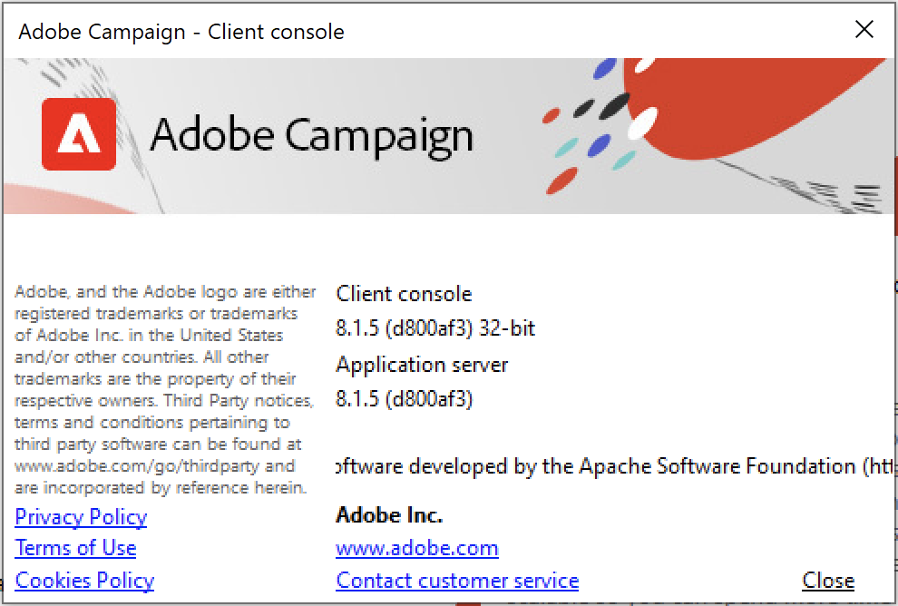

# Versiones y actualizaciones {#upgrades}

Adobe Campaign v8 se ofrece exclusivamente como solución de **Managed Cloud Services**. Adobe administra y realiza cada actualización del lado del servidor por usted: no hay implementación local o híbrida de v8 ni actualización de servidor para programar o realizar usted mismo.

Adobe Campaign se actualiza periódicamente. Esta frecuencia regular de actualizaciones tiene como objetivo ofrecerle lo más novedoso y lo mejor, mantener el entorno seguro y mejorar su experiencia con nuestro producto.

Como usuario de Cloud Services administrados:

* Adobe actualiza la instancia del servidor de Campaign con cada nueva versión, de forma automática y sin que sea necesario que realice ninguna acción.
* El representante de Adobe se pondrá en contacto con usted antes de cualquier actualización que afecte a su entorno.
* **Su consola de cliente es el único componente que usted es responsable de mantener actualizado.** Debe actualizarse a la misma versión que el servidor de Campaign. Obtenga información sobre cómo actualizar la consola del cliente en [esta página](../start/connect.md#upgrade-ac-console).

Además, como cliente, asegúrese de que utiliza la última versión compatible de los sistemas que se enumeran en la [Matriz de compatibilidad](compatibility-matrix.md).

>[!IMPORTANT]
>
>Adobe se reserva el derecho de aplicar parches de seguridad críticos a su entorno alojado en cualquier momento, sin previo aviso, para solucionar las vulnerabilidades lo antes posible. Estos parches se implementan sin interrupción del servicio. La corrección de una vulnerabilidad crítica tiene prioridad sobre las notificaciones avanzadas.

## Versiones de Campaign {#versions}

Adobe Campaign publica periódicamente versiones de productos que mejoran el rendimiento, la seguridad, la lógica y la facilidad de uso de su infraestructura de Campaign.

Estas actualizaciones pueden ser:

* **Actualizaciones principales**, de una versión principal a otra, por ejemplo, de la versión 7 a la 8. Estas actualizaciones aportan nuevas funciones, mejoras, actualizaciones de compatibilidad y seguridad, y correcciones.
* **Actualizaciones menores**, de una versión menor a otra, por ejemplo, de la versión 8.5 a la 8.6. Estas actualizaciones traen mejoras, actualizaciones de compatibilidad y seguridad, y correcciones.
* **Actualizaciones de parches**, de una versión de parche a otra, por ejemplo, de la versión 8.5.1 a la 8.5.2. Estas actualizaciones traen actualizaciones y correcciones de seguridad.

Encontrará información detallada sobre cada nueva versión en las [Notas de la versión](release-notes.md). Las correcciones relacionadas con la seguridad se indican en las notas de cada versión. Consulte [¿Cómo puedo recibir información sobre el lanzamiento de una nueva versión?](#upgrades-0) más abajo.

Para garantizar una configuración estable, Adobe recomienda instalar **exactamente la misma versión** en todos los servidores de Campaign. Además, salvo que se indique lo contrario en las [notas de la versión](release-notes.md), la consola del cliente debe estar en **la misma versión** que la instancia del servidor. Obtenga información sobre cómo actualizar la consola cliente [en esta página](../start/connect.md#upgrade-ac-console).

## Mantenga la consola de cliente actualizada {#ac-upgrades}

Como cliente de Campaign Managed Services, cuando hay una nueva versión de Campaign disponible, Adobe actualiza la infraestructura del servidor sin que tenga que realizar ninguna otra acción.

Como la actualización del servidor se produce automáticamente, la **consola de cliente** es el único lugar donde puede aparecer un espacio si no se actualiza al mismo tiempo. Si la versión de la consola no coincide con la versión del servidor:

* Puede perder la capacidad de conectarse a la instancia de Campaign hasta que se actualice la consola.
* La consola deja de beneficiarse de las correcciones y actualizaciones de seguridad incluidas en la versión a la que el servidor ya se ha trasladado, aunque el servidor en sí mismo esté actualizado.

Para evitarlo, actualice la consola de cliente en cuanto se le notifique una nueva versión. Aprenda a [actualizar la consola de cliente](../start/connect.md#upgrade-ac-console).

Tenga en cuenta que, como cliente de, también debe asegurarse de que está utilizando las últimas versiones compatibles de los sistemas enumerados en la [Matriz de compatibilidad](compatibility-matrix.md).

## Preguntas frecuentes {#upgrades-faq}

### ¿Cómo puedo comprobar mi versión de Campaign? {#version}

Para comprobar su versión de Campaign, acceda al menú **Ayuda > Acerca de...** desde la consola del cliente.

Puede acceder a la siguiente información:

* El número **version** de su consola de cliente y servidor de aplicaciones. En el ejemplo anterior, la versión es 8.1.5 tanto para la consola del cliente como para el servidor de aplicaciones.
* El número SHA, entre paréntesis.
* Un vínculo para ponerse en contacto con el Servicio de atención al cliente de Adobe.
* Vínculos a la Política de privacidad de Adobe, a las Condiciones de uso y a la Política de cookies.

>[!NOTE]
>
>Si la versión mostrada para la consola de cliente no coincide con la versión mostrada para el servidor de aplicaciones, actualice la consola tal como se describe en [Mantenga la consola de cliente actualizada](#ac-upgrades).

### ¿Cómo puedo estar informado del lanzamiento de una nueva versión? {#upgrades-0}

Las nuevas versiones y los cambios que traen, incluidas las correcciones de seguridad, se enumeran en [Notas de la versión](release-notes.md). Una vez que haya disponible una nueva versión, el representante de Adobe se pondrá en contacto con usted y actualizará los entornos de servidor; deberá actualizar por separado la consola de cliente (consulte [Mantener actualizada la consola de cliente](#ac-upgrades)).

Para recibir información sobre las nuevas versiones de la solución Experience Cloud y su contenido, suscríbase a la comunicación [Actualizaciones prioritarias del producto de Adobe](https://www.adobe.com/es/subscription/priority-product-update.html){target="_blank"}.

También puede visitar la [Comunidad de Campaign](https://experienceleaguecommunities.adobe.com/t5/custom/page/page-id/Community-TopicsPage?profile.language=es&style=all&sort=date&order=desc&filters=adobe-campaign-classic-community&topic=Campaign+v8){target="_blank"} para recibir información sobre las actualizaciones de la versión.

### ¿Por qué necesita mi organización una actualización? {#upgrades-1}

La actualización garantiza que su cuenta está segura frente a vulnerabilidades y que utiliza una tecnología de rendimiento actualizada.

Normalmente, la actualización a la versión más reciente trae consigo:

* **Mayor seguridad**

  La seguridad necesita un enfoque constante y mantenimiento proactivo. Los riesgos de seguridad son omnipresentes y no se pueden ignorar: cada actualización para Campaign mejora la seguridad. Una combinación de tecnologías funciona en conjunto para impulsar Adobe Campaign, y todas ellas deben estar actualizadas. Adobe aplica estas actualizaciones al servidor automáticamente; la actualización de la consola de cliente en este paso garantiza que la misma protección se extienda a él.

* **Compatibilidad mejorada**

  Los problemas más graves se resuelven con las actualizaciones y se pueden evitar por completo. Las actualizaciones regulares ayudan a reducir los desafíos a los que se enfrenta y aumentar la eficacia. El volumen del Servicio de atención al cliente se reduce, lo que permite una resolución más rápida y una mayor atención a los problemas que no están relacionados con las actualizaciones.

* **Mantenimiento y estabilidad mejorados**

  Con el tiempo, el equipo de Adobe Campaign identifica las formas de mejorar la estabilidad y el rendimiento del producto, así como de solucionar problemas conocidos. La actualización actualiza la instancia con estas mejoras y elimina los desafíos comunes a los que se enfrentan las organizaciones que experimentan un rápido crecimiento y/o complejidad en sus instancias de Campaign. Las mejoras de la pila tecnológica de Campaign se ven en los equipos de marketing y TI de su organización.

* **Permanecer conectado**

  La consola de cliente solo puede comunicarse de forma fiable con un servidor que ejecute la misma versión. Mantener la consola actualizada, cada vez que se actualiza el servidor, es lo que mantiene intacta esta conexión, así como la seguridad y las correcciones que conlleva.

### ¿Cuál es el proceso y la cronología de una actualización? {#upgrades-2}

Como cliente de la versión 8, Adobe administra la actualización de servidor de extremo a extremo:

1. Cuando hay una nueva versión disponible o se identifica que su cuenta debe pasar a una, su representante de Adobe se lo notifica.
1. Adobe actualiza su infraestructura de servidor: no es necesario que realice ninguna acción en este paso.
1. Por su parte, la única acción necesaria es actualizar la consola de cliente para que coincida y confirmar que los sistemas de su [matriz de compatibilidad](compatibility-matrix.md) siguen siendo compatibles. Ver [Mantén tu consola de cliente actualizada](#ac-upgrades).

Un equipo de representantes del Servicio de atención al cliente, gerentes de productos, ingenieros, especialistas en TechOps y consultores de productos está preparado para ayudarle y garantizar que la experiencia sea fluida.

>[!NOTE]
>
>Pueden aplicarse parches de seguridad críticos al entorno alojado fuera de este ciclo de notificación (consulte la nota en la parte superior de esta página).
