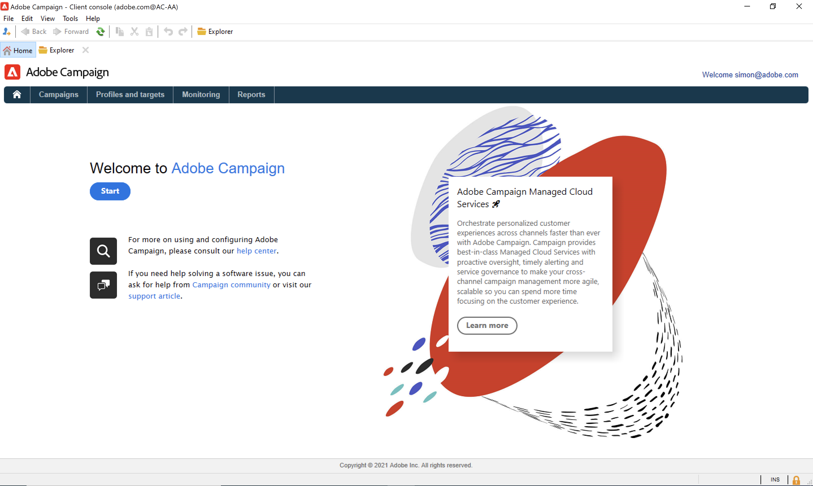

# ¿Qué novedades hay en Adobe Campaign v8?  {#ac-gs-what-is-new}

Adobe Campaign v8 ofrece mejoras significativas en infraestructura, seguridad, capacidad de envío y supervisión. Al aprovechar [[!DNL Snowflake]](https://www.snowflake.com/), una tecnología de base de datos en la nube, Adobe Campaign mejora considerablemente su escala y velocidad, con la capacidad de administrar una cantidad más significativa de perfiles de clientes, así como tasas de entrega y transacciones por hora mucho más altas.

Las funciones clave incluyen:

* **Velocidad y escala**. Adobe Campaign v8 aprovecha Cloud Database Manager, lo que permite que las consultas se realicen hasta 200 veces más rápido, escalas de varios petabytes, un mayor número de mensajes por hora (con hasta 20 millones/hora o 1 millones/hora en el caso de mensajes transaccionales) y administración de hasta 200 millones de perfiles activos con el potencial de alcanzar 1 B.

* **Conexiones a Adobe Experience Platform**. Adobe Campaign v8 admite conectores de datos con Adobe Experience Platform/RT-CDP, perfil de cliente unificado e integración nativa con Journey Orchestration. Estas inversiones optimizarán la experiencia del cliente de Adobe Campaign y desbloquearán nuevos casos de uso, como la capacidad de añadir recorridos personalizados del cliente en tiempo real a las campañas.

* **Cloud Services administrados**. Adobe Campaign v8 está disponible como los mejores Cloud Services administrados de su clase, y proporciona supervisión proactiva, alertas oportunas y administración de servicios. El valor para el experto en marketing es una administración de campañas en canales múltiples más ágil y escalable.

>[!CAUTION]
>
>Por ahora, Campaign v8 **solo** está disponible como Cloud Service administrado y no se puede implementar en entornos locales o híbridos.
>
>La migración desde un entorno de Campaign Classic v7 existente aún no está disponible.
>
>Si no está seguro del modelo de implementación o tiene alguna pregunta, póngase en contacto con el equipo de la cuenta.

## Escala

Campaign v8 ofrece una escala de extremo a extremo en cualquier paso del proceso, desde direccionamiento hasta la creación de informes final:

* Escalar el volumen de datos que puede gestionar (hasta 8 TB)
* Escalar el rendimiento de las consultas para segmentación y direccionamiento, pero también el consumo y la salida de datos
* Escalar la preparación del envío (de horas a minutos)

## Simplificación y aumento del rendimiento

Campaign v8 incorpora el concepto de **Acceso de datos federado completo** (FDA): todos los datos ahora son remotos en la base de datos de Cloud.

Con esta nueva arquitectura, Campaign v8 simplifica la administración de datos: no se requiere ningún índice en la base de datos en la nube. Basta con crear las tablas, copiar los datos y empezar.

[!DNL Snowflake] es la base de datos de Campaign Cloud que le proporcionará velocidad y solidez: no hay sobrecarga de los picos de actividad del sistema.

La tecnología de la base de datos en la nube no requiere un mantenimiento específico para garantizar el nivel de rendimiento.

## Ecosistema integrado

Puede integrar Campaign con un conjunto de sólidas soluciones de Adobe, como Adobe Analytics, Adobe Journey Orchestration, CDP en tiempo real, etc.

También puede configurar la optimización del tiempo de envío predictivo y la puntuación de participación predictiva con la inteligencia artificial aplicada a la trayectoria, y aumentar las tasas de apertura, los clics y los ingresos.

 [Obtenga más información sobre las integraciones de Campaign](../connect/integration.md)

